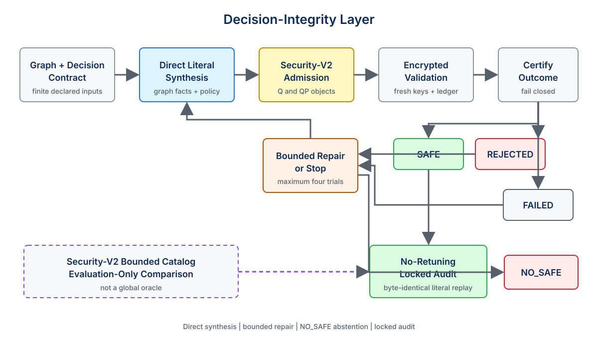
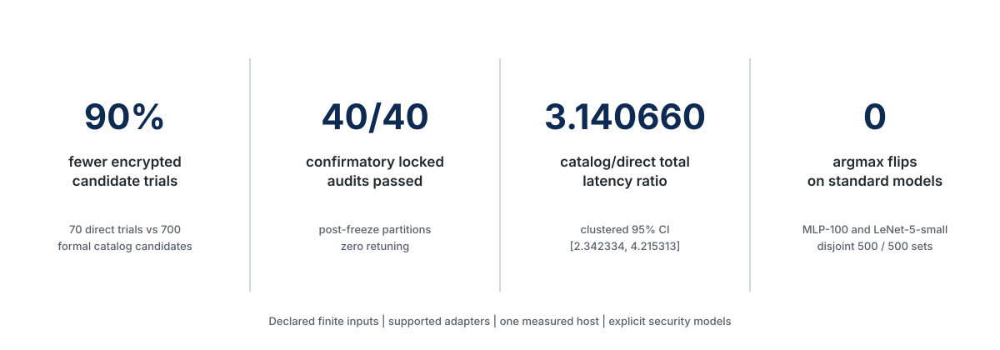

<p align="center">
  <picture>
    <source media="(prefers-color-scheme: dark)" srcset="docs/assets/brand/flipguard-wordmark-dark.svg">
    <source media="(prefers-color-scheme: light)" srcset="docs/assets/brand/flipguard-wordmark.svg">
    
  </picture>
</p>

<p align="center">
  <strong>Decision-integrity-aware direct synthesis and validation of CKKS configurations.</strong>
</p>

<p align="center">
  English | <a href="README_ko.md">한국어</a>
</p>

<p align="center">
  <a href="https://github.com/hasslelee/flipguard/actions/workflows/ci.yml"></a>
  
  
  <a href="https://github.com/hasslelee/flipguard/tree/flipguard-thesis-v1.0.0-rc2"></a>
  <a href="docs/REPRODUCIBILITY.md"></a>
</p>

<p align="center">
  <a href="#quick-start"><strong>Quick Start</strong></a> ·
  <a href="#architecture">Architecture</a> ·
  <a href="#results-at-a-glance">Results</a> ·
  <a href="docs/REPRODUCIBILITY.md">Reproducibility</a> ·
  <a href="docs/CLAIM_SCOPE.md">Claim Scope</a> ·
  <a href="#citation">Citation</a>
</p>

| 90% fewer trials | 40/40 locked audits | 3.140660 catalog/direct ratio | 0 multiclass argmax flips |
|:---:|:---:|:---:|:---:|
| 70 direct / 700 catalog | Confirmatory, no retuning | 95% CI [2.342334, 4.215313] | MLP-100 and LeNet-5-small |

> Results are limited to declared finite inputs, supported adapters, one measured host, and explicit security models.

FlipGuard directly synthesizes and validates CKKS configurations under explicit decision-integrity contracts. It treats the final threshold or argmax decision as an admission target, not merely the numerical score. A built-in provider derives a CKKS literal from supported graph facts, then encrypted validation and bounded repairs produce `SAFE`, `REJECTED`, `FAILED`, or `NO_SAFE`. Once selected, the exact literal is replayed without retuning on a disjoint locked audit. A Security-V2-compliant bounded catalog remains an evaluation-only comparison, not a global oracle.

**Direct synthesis · bounded repair · NO_SAFE abstention · locked audit**

## Why FlipGuard?

Approximate CKKS arithmetic introduces numerical error. A configuration can execute successfully and still move a score across a decision threshold or change the largest logit. Configuration tools commonly optimize depth, scale, error, bootstrapping, or latency; FlipGuard adds a common **Decision-Integrity Layer** that asks whether the declared decision remains defensible on finite validation evidence.

The project focuses on three practical gaps:

- candidate generation should not require enumerating every profile in a fixed catalog;
- executable candidates still need decision-aware encrypted admission;
- selection and final assessment must be separated to expose retuning and audit failures.

FlipGuard is a research framework, not a universal CKKS compiler or production inference engine. Its empirical guarantees are scoped to declared inputs, supported graph adapters, frozen policies, observed fresh-key runs, and stated security models.

## Key Ideas

1. **Decision-integrity contracts.** Binary thresholds use score margin; multiclass predictions use pairwise top-logit separation.
2. **Direct literal synthesis.** Graph depth, scale trace, required slots, and the decision contract produce an initial CKKS literal without catalog enumeration.
3. **Bounded failure-aware repair.** Numerical and level failures trigger predeclared repairs under a maximum of four encrypted trials.
4. **Certify or abstain.** FlipGuard selects the first `SAFE` literal or returns `NO_SAFE`; `NO_SAFE` is bounded evidence, not global infeasibility.
5. **No-retuning audit.** The selected literal is locked and replayed byte-identically on a disjoint audit partition.
6. **Traceable evidence.** Source, prepared, and semantic identities, policy digests, execution ledgers, and deterministic verifiers remain distinct.

## Architecture

<picture>
  <source media="(prefers-color-scheme: dark)" srcset="docs/assets/figures/flipguard-overview-dark.svg">
  <source media="(prefers-color-scheme: light)" srcset="docs/assets/figures/flipguard-overview.svg">
  
</picture>

The main path is:

```text
supported graph + decision contract
  -> direct literal synthesis
  -> Security-V2 admission
  -> encrypted validation
  -> bounded repair
  -> first SAFE or NO_SAFE
  -> no-retuning locked audit
```

The Security-V2 bounded catalog is an evaluation-only side path. Manual configurations and external providers can be evaluated by the same gate, but broad external-autotuner interoperability remains outside the admitted core claims. See [Architecture](docs/ARCHITECTURE.md) for module boundaries and evidence flow.

## Results at a Glance



| Result | Observation | Scope |
|---|---:|---|
| Formal candidate-trial reduction | 70/700 overall and 56/560 confirmatory, **90% reduction** | 50 workload-partition instances; the historical pre-security ledger is excluded from this denominator |
| Confirmatory locked audit | **40/40 PASS**, retuning 0 | seeds 1–4 across 10 dataset-model clusters; repeated partitions are not independent models |
| Paired total latency | catalog/direct geometric-mean ratio **3.140660**, clustered 95% CI **[2.342334, 4.215313]** | one host; Security-V2 bounded-catalog fastest-safe vs direct; dataset-model cluster is the inference unit |
| Standard multiclass decision integrity | MLP-100 and LeNet-5-small each had **0 argmax flips** | each model used 500 validation and 500 disjoint locked-audit MNIST images, with three fresh keys |

The natural top-two-gap contract changed the MLP-100 literal from S32 to S29. It did **not** establish S29-over-S32 latency superiority: the graph-only/direct total-latency ratio was 0.999780 with 95% CI [0.998648, 1.000920]. Against the frozen catalog S40 arm, the S40/S29 ratio was 1.981795 with 95% CI [1.979758, 1.983842]. For LeNet-5-small, the frozen catalog result was **7/7 `PLAN_UNSUPPORTED`**; this is neither `NO_SAFE` nor a claim of global infeasibility.

Read [Results](docs/RESULTS.md) for formal denominators, negative results, security qualifications, and direct evidence links.

## Decision-Integrity Contracts

For a binary threshold decision, define the plaintext margin and CKKS absolute error:

```text
m(x) = |f_plain(x) - tau|
e(x) = |f_CKKS(x) - f_plain(x)|
```

The sufficient condition `e(x) < m(x)` preserves the threshold decision. FlipGuard's primary operational policy is stricter:

```text
e(x) < rho * m(x), where rho = 0.5
```

Here, `rho=0.5` is a predeclared margin-utilization cap. It is not a theorem constant, an optimum, or a universal CKKS parameter.

For multiclass logits, let `c*` be the plaintext argmax and let `B_k` bound the error of logit `k`. If, for every `j != c*`,

```text
z_c*(x) - z_j(x) > B_c*(x) + B_j(x),
```

then the argmax class is preserved. Under a uniform per-logit bound `B`, the corollary is `2B < top-two gap`. Ties, non-finite values, and boundary equality fail closed. The proof and exact `V_cert` / `V_amb` definitions are in [Decision-Integrity Contracts](docs/DECISION_CONTRACTS.md).

## Supported Scope

The current implementation and frozen evidence cover:

- scalar-replicated tabular linear and square-activation MLP adapters;
- a deeper polynomial MLP holdout;
- finite Sobel, Harris, and CNN-lite adapters within their declared layouts;
- MNIST MLP-100 and an FHE-compatible square-activation LeNet-5-small adapter;
- binary threshold and multiclass argmax contracts;
- Lattigo v6.2.0 CKKS execution with explicit `Q` and `QP` security checks;
- direct synthesis, first-SAFE stopping, bounded repair, `NO_SAFE`, and locked-audit replay.

It does not establish arbitrary graph or packed-CNN support, global optimality, distribution-wide safety, a complete analytical CKKS certificate, universal 128-bit security for arbitrary runtime distributions, or production-hardware speedups. The precise admitted and blocked statements are listed in [Claim Scope](docs/CLAIM_SCOPE.md).

## Quick Start

### 1. Clone and check dependencies

```bash
git clone https://github.com/hasslelee/flipguard.git
cd flipguard
go version
go mod download
```

The frozen public source uses Go 1.25.9 and Lattigo v6.2.0. Python utilities used by CI are listed in `requirements-ci.txt`.

### 2. Inspect the direct-synthesis CLI

```bash
go run ./cmd/flipguard-synthesize --help
```

### 3. Run a static synthesis demo

This command analyzes a frozen model and validation contract and emits a candidate plan. It does not launch the thesis-grade encrypted suite.

```bash
go run ./cmd/flipguard-synthesize \
  --model datasets/tabular_suite/banknote/mlp_square_linear_score/model.json \
  --validation docs/evidence/direct_locked_audit_seed0_development_v1/inputs/prepared_validation/seed0__banknote__mlp_square_linear_score.csv \
  --split-id public_smoke_v1 > /tmp/flipguard-public-smoke.json

python3 -m json.tool /tmp/flipguard-public-smoke.json >/dev/null
```

### 4. Run unit tests

```bash
go test ./...
go vet ./...
python3 -m unittest scripts.tests.test_lint_public_readme
```

The README commands above are checked on this branch. Encrypted reproduction is intentionally separate because it has stricter provenance, runtime, disk, and source-identity requirements.

## Reproducing the Results

Reproduction is organized by cost and purpose:

| Level | Purpose | Typical work |
|---|---|---|
| Five-minute smoke | dependency and CLI sanity | static synthesis plus focused tests |
| 30–60 minute verification | artifact and policy integrity | deterministic verifiers; no new encrypted measurements |
| Artifact-only verification | validate frozen packs | checksums, manifests, source replay, and claim overlays |
| Full thesis-grade reproduction | reconstruct encrypted evidence | dedicated host, frozen source, resumable ledgers, and substantial runtime |

Start with [Reproducibility](docs/REPRODUCIBILITY.md). Do not run a final suite casually beside another CKKS process: paired latency and fresh-key accounting require the declared execution protocol.

## Repository Layout

```text
cmd/                     Go command-line entry points
internal/                synthesis, certification, execution, and audit logic
configs/                 frozen policy and profile definitions
datasets/                source metadata, derived artifacts, and model contracts
scripts/                 builders, verifiers, and orchestration
docs/research/           protocol and research design documents
docs/evidence/           immutable evidence packs and overlays
results/                 frozen ledgers, summaries, and publication inputs
docs/assets/             public brand and GitHub figures
```

The repository contains historical and final artifacts side by side. A newer evidence overlay does not overwrite its predecessor. See [Repository Guide](docs/REPOSITORY_GUIDE.md) before interpreting a result directory.

## Research Artifacts

- **Core release:** [`flipguard-thesis-v1.0.0-rc2`](https://github.com/hasslelee/flipguard/tree/flipguard-thesis-v1.0.0-rc2), bound to source commit `6c5f8b234f9f9da91a189fa0f2dc180bb996abf5`.
- **Core claim registry:** [`docs/evidence/paper_claim_admission_v1`](docs/evidence/paper_claim_admission_v1/).
- **Security-V2 bounded oracle:** [`docs/evidence/security_v2_bounded_oracle_v1`](docs/evidence/security_v2_bounded_oracle_v1/).
- **Final multiclass extension:** [`docs/evidence/journal_multiclass_extension_final_v1`](docs/evidence/journal_multiclass_extension_final_v1/).
- **Multiclass claim registry:** [`docs/evidence/journal_multiclass_claim_admission_v2`](docs/evidence/journal_multiclass_claim_admission_v2/).
- **Paired-latency admission:** [`results/thesis_grade_protocol/paired_latency_claim_admission_v1`](results/thesis_grade_protocol/paired_latency_claim_admission_v1/).

These packs preserve negative results and separate functional execution, decision-integrity admission, security-policy admission, estimator-model status, performance evidence, and claim eligibility. This repository is the research artifact and implementation accompanying the FlipGuard project. The paper manuscript is in preparation.

## Claim Boundaries

Use the repository's canonical claim registries when reporting FlipGuard. In particular:

- `SAFE` means that a candidate passed the declared finite encrypted validation and reserve policy; it is not distribution-wide proof.
- `NO_SAFE` means no `SAFE` candidate was established within the frozen bounded trial policy; it is not global infeasibility.
- `PLAN_UNSUPPORTED` means a profile cannot instantiate the declared graph; it is distinct from execution failure and decision rejection.
- The bounded-catalog fastest-safe arm is not a global oracle or global optimum.
- Security-V2 admission and estimator-model sensitivity are reported separately.
- MLP-100 S29 and S32 had different literals, but no S29-over-S32 latency advantage was established.
- One structural locked audit was reserve-policy rejected without an observed decision flip; negative evidence is retained.

See [Claim Scope](docs/CLAIM_SCOPE.md) for allowed wording and limitations.

## Citation

No paper acceptance, venue, or DOI is claimed. Until verified author metadata and a publication record are available, cite the software artifact by repository, version, and commit:

```bibtex
@software{flipguard2026,
  title   = {FlipGuard: Decision-Integrity-Aware Direct Synthesis and Validation of CKKS Configurations},
  author  = {{FlipGuard contributors}},
  year    = {2026},
  version = {flipguard-thesis-v1.0.0-rc2},
  url     = {https://github.com/hasslelee/flipguard}
}
```

A `CITATION.cff` file will be added only after author metadata can be verified without relying on an anonymous manuscript.

## Contributing

Contributions are welcome within the project's evidence discipline. Read [CONTRIBUTING.md](CONTRIBUTING.md) before opening a pull request. Research changes must declare whether they affect execution semantics, preserve frozen evidence, add tests, and avoid expanding claims beyond verified artifacts.

## Security

Do not disclose suspected vulnerabilities, secrets, or key material in a public issue. Follow [SECURITY.md](SECURITY.md) for private reporting guidance and for the distinction between implementation vulnerabilities and documented research limitations.

## License

This repository does not currently publish a software license. Copyright permission is therefore not implied; obtain explicit permission before copying, modifying, or redistributing the code or artifacts. A license badge is intentionally omitted.
