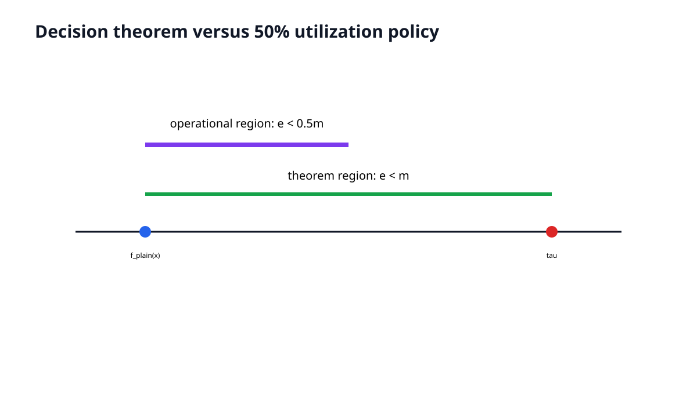
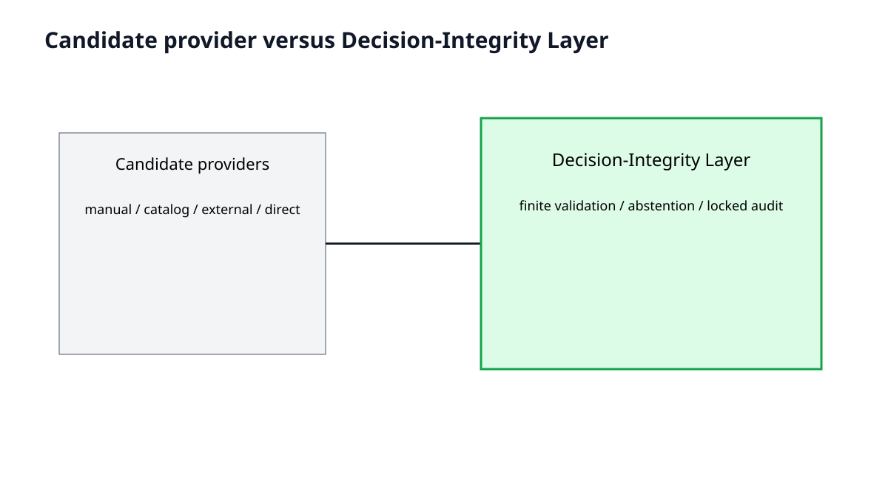
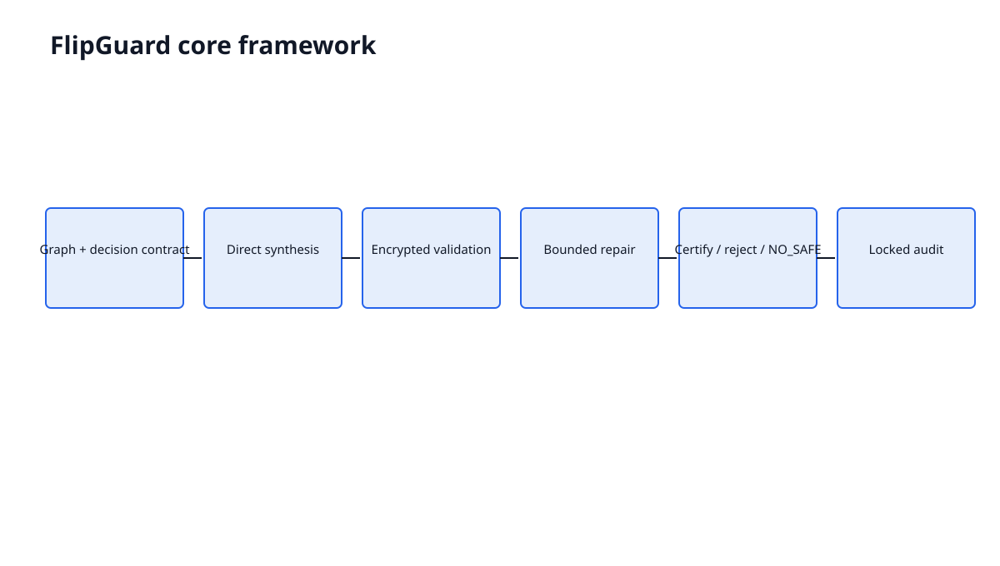
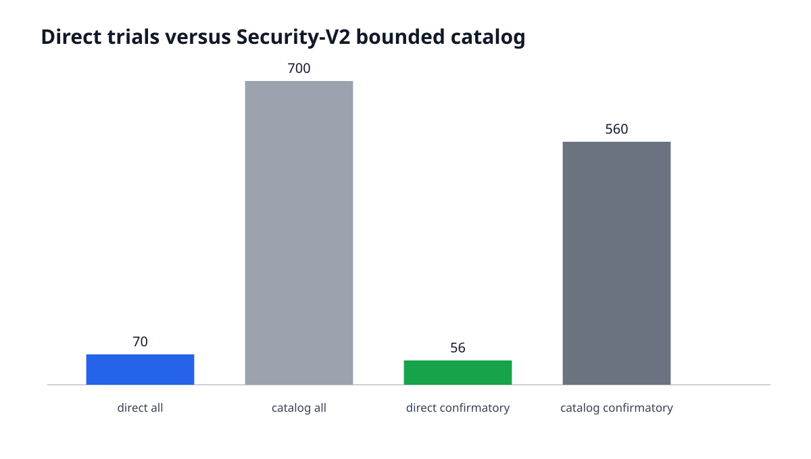
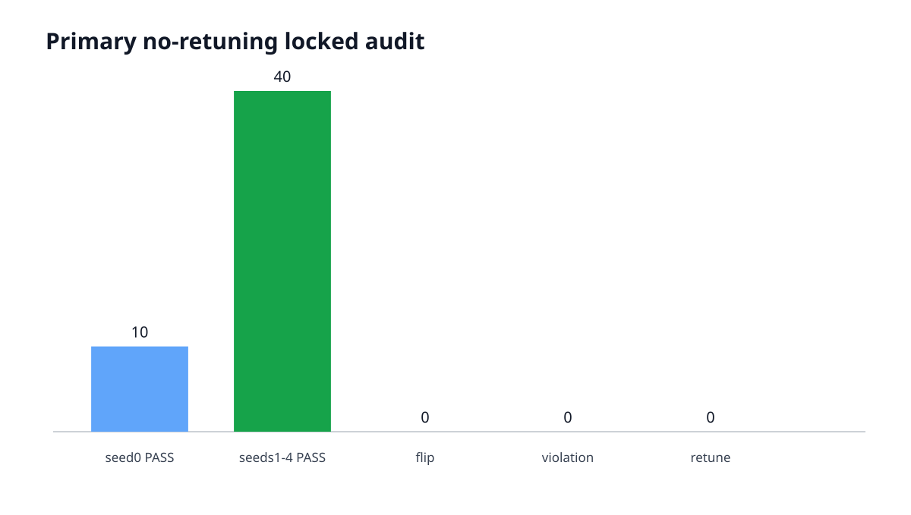
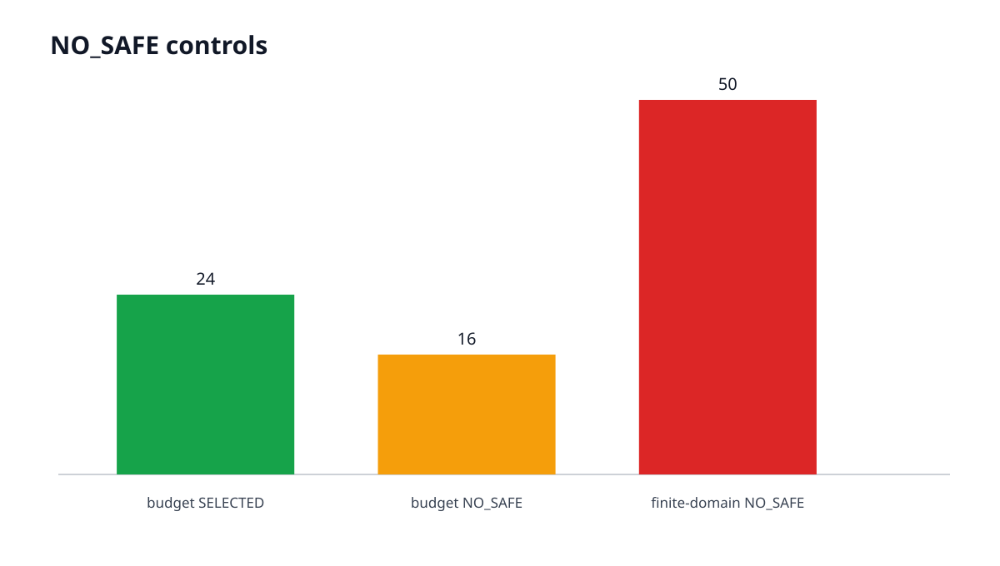
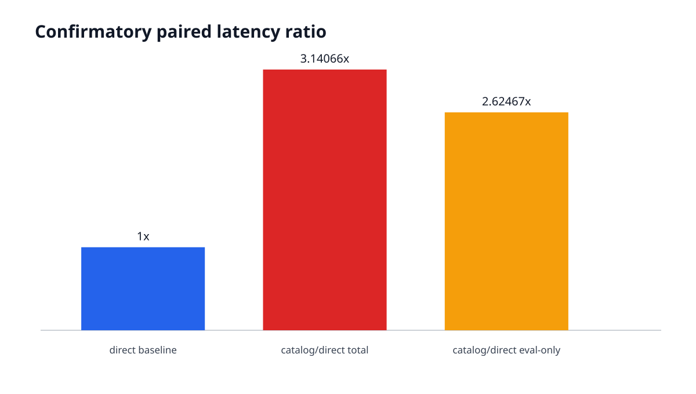
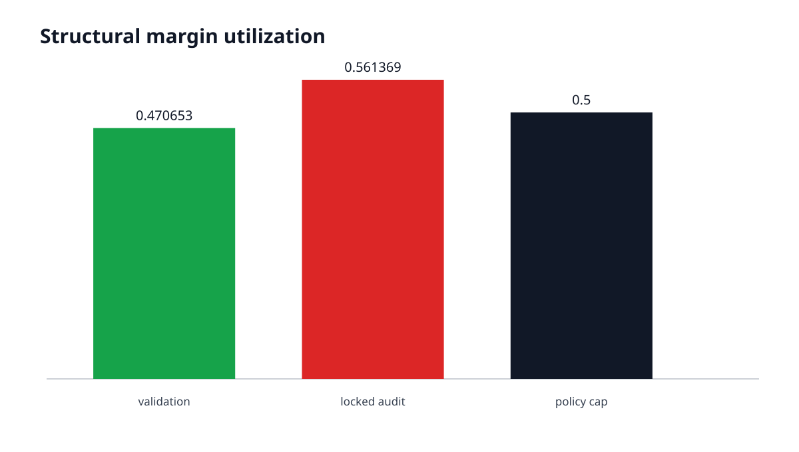
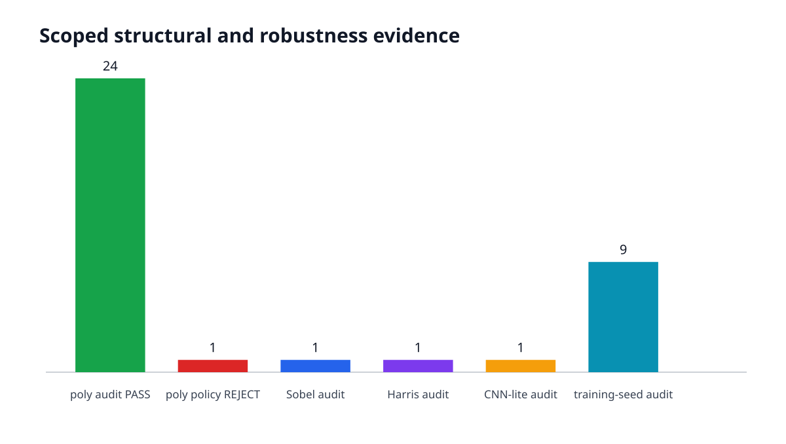
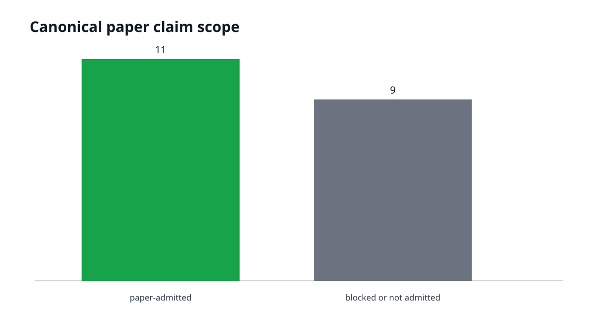

# 결정 무결성 계약 기반 CKKS 실행 구성 직접 합성 및 검증 기법

**English title:** FlipGuard: Decision-Integrity-Aware Direct Synthesis and Validation of CKKS Configurations

**Status:** AUTHORITATIVE_DRAFT_V1

**RC2 source commit:** `6c5f8b234f9f9da91a189fa0f2dc180bb996abf5`

**RC2 archive SHA-256:** `05ef70306a11ab577243b0c708489864f19ccd104e6036e28fc6bd1dab45c0be`

**Paper Artifacts V3 manifest SHA-256:** `32d378b371b75d31b8e39ef2acce4c3c7353581ccfbd5e6c7d22b30ffaf4743b`

**Claim admission manifest SHA-256:** `d982f0f81915b760c537244fc71aa992bf521eaf65d57a67c2d96dbae0607b8d`

**Margin interpretation manifest SHA-256:** `12626638b1abb5d57155345ee84e7e145dc13bfc947767f4484b1e18475cdce0`

**Draft build timestamp:** `2026-08-02T00:38:14+09:00`

**Thesis branch/commit:** `thesis/flipguard-draft-v1` / `4f109ddc972bd80e5c1871c2b4bef80f493b3900`

**University formatting status:** CONTENT_COMPLETE_TEMPLATE_PENDING

---

# 국문 초록

## 결정 무결성 계약 기반 CKKS 실행 구성 직접 합성 및 검증 기법

CKKS 근사 동형암호는 암호화된 실수형 데이터에 대한 계산을 지원하지만, 스케일(scale), 모듈러스 체인(modulus chain), 다항식 차수(polynomial degree), 실행 경로의 선택에 따라 수치 오차와 지연시간이 크게 달라진다. 특히 점수를 임계값과 비교하는 응용에서는 작은 근사 오차가 최종 결정을 바꿀 수 있으므로 실행 가능성이나 평균 오차만으로 구성을 승인하기 어렵다. 기존 컴파일러와 자동 조정기(autotuner)는 파라미터, 스케일, 부트스트래핑, 지연시간과 정확도 최적화를 발전시켰으나, 서로 다른 후보 출처에 공통으로 적용되는 임계값 결정 무결성 승인과 무재조정 잠금 감사는 별도 문제로 남는다.

<!-- P:ABSTRACT-KO-METHOD CLAIM:scoped_direct_synthesis,adaptive_repair,finite_scope_decision_integrity -->
본 논문은 지원 계산 그래프와 임계값 결정 무결성 계약에서 구체적인 CKKS 리터럴을 직접 합성하는 FlipGuard를 제안한다. FlipGuard는 그래프 특성으로부터 스케일, Q/P 체인, LogN을 계산하고 최대 4번의 암호화 후보 시험으로 후보를 검증한다. 실패 원인이 허용된 수치 정밀도 또는 레벨 부족 유형일 때만 제한적 복구를 수행하며 첫 SAFE에서 멈춘다. SAFE 후보를 확립하지 못하면 NO_SAFE로 기권하고, 선택 리터럴은 구성 검증과 분리된 잠금 감사에서 재조정 없이 재생한다. 결정 보존 충분조건 `e_c(x)<m(x)`과 운용 여유 정책 `e_c(x)<0.5m(x)`를 구분하며, 후자의 0.5는 사전동결 margin-utilization cap이지 이론적 최적값이 아니다.

<!-- P:ABSTRACT-KO-PRIMARY CLAIM:formal_trial_reduction,primary_no_retuning_locked_audit,no_safe_behavior -->
주요 평가는 5개 데이터셋, 2개 모델 그래프, 5개 결정론적 반복 분할로 구성한 50개 작업부하-분할 인스턴스를 사용했다. Seed 0는 개발·기술 결과, seeds 1--4는 동결 이후 확인 평가로 분리했다. Security-V2가 허용한 정식 bounded catalog는 전체 700개 후보, 확인 평가 560개 후보다. 직접 합성은 전체 70회와 확인 평가 56회의 후보 시험을 사용해 두 경우 모두 90% 감소를 기록했다. 무재조정 잠금 감사는 확인 평가 40/40과 개발 평가 10/10에서 PASS했고 재조정은 0회였다. 사전 선언한 후보 예산 대조군은 16/40에서, 유한 후보 영역 대조군은 50/50에서 NO_SAFE를 반환했다.

<!-- P:ABSTRACT-KO-EXT CLAIM:paired_latency,structural_extension,scoped_non_tabular_extension,training_model_seed_extension -->
동일 호스트의 쌍체 측정 프로토콜에서 Security-V2 bounded-catalog 전체 지연시간을 직접 합성 전체 지연시간으로 나눈 확인 평가 데이터셋-모델 군집 기하평균은 3.140660이었고, 군집 부트스트랩 95% 신뢰구간은 [2.342334, 4.215313]이었다. 더 깊은 다항식 그래프 `mlp_square_poly3`는 25/25 선택 후 잠금 감사 24건 PASS와 결정 뒤집힘이 없는 reserve-policy REJECT 1건을 기록했다. Sobel, Harris, scalar-replicated CNN-lite 및 3개 데이터셋 x 3개 독립 학습·데이터 seed 확장은 각각 선언된 유한 범위에서 선택과 감사 근거를 제공했다.

결과는 유한한 검증·감사 artifact, 지원 adapter, 동결 정책, 한 호스트의 지연시간 범위에 한정된다. 본 논문은 분포 전체의 결정 안전성, 임의 그래프 지원, 구성 공간 전체의 최적성, 운영 환경 성능, 실행 분포와 estimator의 완전한 동등성, 분석적 CKKS certificate를 주장하지 않는다. FlipGuard의 기여는 후보 생성 자체의 최초성보다 직접 합성, 경험적 결정 승인, 제한적 복구, 기권, 변경 불가능한 감사 재생과 provenance를 하나의 재현 가능한 결정 무결성 계층으로 결합한 데 있다.

**주제어:** CKKS, 동형암호, 구성 합성, 결정 무결성, 암호화 검증, NO_SAFE, locked audit

# English Abstract

## FlipGuard: Decision-Integrity-Aware Direct Synthesis and Validation of CKKS Configurations

The CKKS approximate homomorphic-encryption scheme enables computation over encrypted real-valued data, but its numerical error and latency depend strongly on the scale, modulus chain, polynomial degree, and execution path. In applications that compare a score with a threshold, even a small approximation error can change the final decision. Execution success or an aggregate error metric alone is therefore insufficient for admitting a configuration. Existing compilers and autotuners have advanced parameter, scale, bootstrapping, latency, and accuracy optimization, while a common threshold decision-integrity admission rule and a no-retuning audit remain distinct concerns across candidate sources.

<!-- P:ABSTRACT-EN-METHOD CLAIM:scoped_direct_synthesis,adaptive_repair,finite_scope_decision_integrity -->
This thesis presents FlipGuard, which directly synthesizes exact CKKS literals from supported computation graphs and threshold decision-integrity contracts. FlipGuard derives the scale, Q/P chain, and LogN from graph facts and validates each candidate with at most 4 encrypted trials. It applies bounded repairs only to predeclared numerical or level failures and stops at the first SAFE candidate. When no SAFE candidate can be established, it abstains with NO_SAFE. The selected literal is then replayed without retuning on a locked audit disjoint from configuration validation. The sufficient decision-preservation condition, `e_c(x)<m(x)`, is explicitly separated from the operational reserve policy, `e_c(x)<0.5m(x)`; 0.5 is a predeclared margin-utilization cap rather than a theoretically optimal constant.

<!-- P:ABSTRACT-EN-PRIMARY CLAIM:formal_trial_reduction,primary_no_retuning_locked_audit,no_safe_behavior -->
The primary evaluation uses 50 workload-partition instances formed from 5 datasets, 2 model graphs, and 5 deterministic repeated partitions. Seed 0 is development/descriptive, whereas seeds 1--4 are post-freeze confirmatory. The Security-V2-admitted formal bounded catalog contains 700 candidates overall and 560 confirmatory candidates. Direct synthesis used 70 and 56 candidate trials, respectively, yielding a 90% formal reduction in both populations. No-retuning locked audit passed for 40/40 confirmatory and 10/10 development instances with 0 retuning. A predeclared budget control returned NO_SAFE in 16/40 instances, and a finite-domain control returned NO_SAFE in 50/50 instances.

<!-- P:ABSTRACT-EN-EXT CLAIM:paired_latency,structural_extension,scoped_non_tabular_extension,training_model_seed_extension -->
Under a paired protocol on one host, the confirmatory dataset-model-cluster geometric mean of Security-V2 bounded-catalog total latency divided by direct total latency was 3.140660, with a cluster-bootstrap 95% confidence interval of [2.342334, 4.215313]. For the deeper polynomial `mlp_square_poly3` graph, all 25 instances were selected; locked audit produced 24 PASS outcomes and 1 reserve-policy REJECT without a decision flip. Sobel, Harris, scalar-replicated CNN-lite, and a 3-dataset by 3-independent-training/data-seed extension provide evidence only within their declared finite scopes.

<!-- P:ABSTRACT-EN-BOUNDARY CLAIM:security_attestation -->
These results are limited to finite validation/audit artifacts, supported adapters, frozen policies, and latency measurements on one host. This thesis does not claim distribution-wide decision safety, arbitrary graph support, whole-space optimality, production performance, exact runtime-estimator distribution equivalence, or a complete analytical CKKS certificate. FlipGuard's contribution is the reproducible integration of direct synthesis, empirical decision admission, bounded repair, abstention, immutable audit replay, and provenance into a decision-integrity layer.

**Keywords:** CKKS, homomorphic encryption, configuration synthesis, decision integrity, encrypted validation, NO_SAFE, locked audit

---

# 제1장 서론

## 1.1 연구 배경

동형암호는 암호문을 복호화하지 않은 상태에서 연산을 수행하고, 그 결과를 복호화했을 때 대응하는 평문 연산 결과를 얻도록 하는 암호 기술이다. 이 성질은 의료, 금융, 공공 데이터처럼 원자료를 외부 계산 주체에 공개하기 어려운 환경에서 계산과 데이터 보호를 동시에 달성할 가능성을 제공한다. 특히 CKKS(Cheon-Kim-Kim-Song) 근사 동형암호 체계는 실수 또는 복소수 벡터에 대한 근사 산술을 지원하므로 통계 처리와 기계학습 추론에 널리 사용된다 [@cheon2017ckks]. 그러나 CKKS의 편의성은 정확한 정수 산술이 아니라 근사 산술이라는 조건과 함께 주어진다. 인코딩, 암호화 잡음, 곱셈, 재선형화, 재스케일 과정에서 발생하는 오차는 설정한 스케일(scale), 모듈러스 체인(modulus chain), 다항식 차수(polynomial degree), 연산 깊이에 따라 달라진다.

CKKS 실행 구성(configuration)을 정하는 일은 단순히 큰 파라미터를 선택하는 문제가 아니다. 큰 환 차원(ring dimension)과 긴 modulus chain은 계산 가능 깊이와 정밀도에 여유를 줄 수 있지만, 키 생성·메모리·연산 지연을 증가시키며 보안 한계에도 제약을 받는다. 반대로 작은 구성은 빠르지만 scale exhaustion, level 부족, 수치 오차 또는 실행 실패를 일으킬 수 있다. 따라서 사용자는 계산 그래프, 입력 범위, 필요한 출력 정확도, 보안 수준을 함께 고려해야 한다. CHET, EVA, HECATE, ELASM, HECO, DaCapo와 같은 컴파일러 및 최적화 연구는 파라미터 선택, scale 관리, 부트스트래핑 배치, 데이터 배치와 코드 생성의 자동화를 발전시켰다 [@dathathri2019chet; @dathathri2020eva; @lee2022hecate; @lee2023elasm; @viand2023heco; @cheon2024dacapo].

본 연구가 다루는 간극은 이들 연구의 가치와 별개로 남는 최종 의사결정 문제다. 분류 또는 위험 판정처럼 출력 점수(score)를 임계값(threshold)과 비교하는 시스템에서는 작은 근사 오차도 score의 수치적 차이보다 더 직접적인 결과를 낳을 수 있다. 평문 score와 CKKS score의 차이가 작더라도, 그 차이가 임계값 반대편으로 score를 이동시키면 최종 결정(decision)이 바뀐다. 반대로 절대오차가 상대적으로 커 보여도 평문 score가 임계값에서 충분히 멀다면 decision은 보존될 수 있다. 그러므로 정밀도(precision), 평균제곱오차(mean squared error), 지연시간(latency)만을 독립적으로 최적화하는 것과 최종 threshold decision을 보존하는 것은 같은 목적이 아니다.

기존 연구가 decision 또는 application accuracy를 전혀 고려하지 않는다고 단정할 수는 없다. AutoPrivacy와 AutoFHE는 정확도와 성능의 절충을 다루며, Application-Aware Approximate Homomorphic Encryption은 회로와 입력 domain에 결합된 correctness 및 security 정의의 필요성을 이론적으로 정리한다 [@lou2020autoprivacy; @ao2024autofhe; @alexandru2024applicationaware]. 본 연구의 중심은 이 흐름을 부정하는 데 있지 않다. 핵심은 서로 다른 구성 제공자(configuration provider)의 출력에 공통으로 적용할 수 있는 임계값 결정 무결성 계약(threshold decision-integrity contract), 후보 단위의 승인·거부, SAFE 후보 부재 시 명시적 기권, 그리고 선택 리터럴(literal)을 재조정 없이 분리된 잠금 감사(locked audit)에서 재생하는 절차를 하나의 검증 계층으로 구성하는 데 있다.

## 1.2 문제 인식

초기 실험 방식은 미리 정한 11개 CKKS profile과 2개 실행 path의 조합을 모든 작업부하-분할 인스턴스(workload-partition instance)에 실행하는 유한 후보 목록(bounded catalog)에 가까웠다. 이 방식은 비교 가능한 유한 후보 집합을 만들고, 실행 가능한 후보와 decision-integrity를 만족하는 후보를 관찰하는 데 유용하다. 또한 가장 빠른 SAFE 후보를 유한 범위에서 식별할 수 있으므로 평가용 기준선으로서 의미가 있다. 그러나 사용자가 새 모델과 데이터셋을 입력할 때마다 같은 catalog를 반복 실행한다면, 계산 그래프에서 이미 알 수 있는 깊이와 scale 요구를 후보 생성에 충분히 활용하지 못한다. 후보 수가 커질수록 실행 비용이 선형으로 증가하고, catalog 밖의 유효한 literal은 처음부터 고려되지 않는다.

이 문제의 해결 방향은 catalog를 더 크게 만드는 것만이 아니다. FlipGuard는 지원되는 계산 그래프에서 연산 깊이, rescale 수, 곱셈 구조, 요구 slot과 같은 사실을 추출하고, threshold decision contract와 동결된 수치·보안 정책을 결합하여 첫 CKKS literal을 직접 합성한다. 그 후보를 실제 암호화 validation에 통과시키고, 실패 원인이 수치 정밀도 또는 level 부족으로 분류될 때만 제한된 repair를 적용한다. 첫 SAFE에서 멈추며, 사전 선언한 trial budget 안에서 SAFE를 확립하지 못하면 NO_SAFE를 반환한다. 이 방식에서 encrypted execution은 configuration search 전체를 대신하는 전수 탐색이 아니라, 정적으로 합성한 후보를 경험적으로 승인하거나 반증하는 단계다.

<!-- P:INTRO-CORE CLAIM:scoped_direct_synthesis,finite_scope_decision_integrity -->
FlipGuard는 선언된 graph adapter와 동결 정책 범위에서 computation graph와 threshold decision-integrity contract로부터 CKKS literal을 직접 합성했다. 또한 선언된 finite validation에서 관측 error와 decision margin을 결합해 후보를 certify-or-reject하고, disjoint audit에서 동결 literal을 재생한다. 여기서 SAFE는 선언된 유한 validation artifact와 관측 fresh-key run에서 정책을 통과했다는 뜻이며, 입력 분포 전체에 대한 수학적 보증을 뜻하지 않는다.

## 1.3 연구 목적과 연구 질문

본 연구의 목적은 지원 그래프와 decision-integrity contract에서 CKKS 실행 literal을 직접 합성하고, 제한된 encrypted trial, bounded repair, NO_SAFE, locked audit을 포함하는 재현 가능한 승인 체계를 구현·평가하는 것이다. 이를 위해 다음 네 연구 질문을 설정한다.

**RQ1.** 지원되는 계산 그래프와 decision-integrity contract에서 CKKS literal을 직접 합성하여 Security-V2 bounded catalog 대비 encrypted candidate trial을 줄일 수 있는가?

**RQ2.** 직접 합성 후보와 bounded repair가 finite validation scope에서 decision-integrity admission을 통과하고, 선택 literal이 disjoint locked audit에서 retuning 없이 유지되는가? 또한 안전한 후보를 확립할 수 없을 때 NO_SAFE를 반환하는가?

**RQ3.** 동일 host의 paired protocol에서 direct configuration은 Security-V2 bounded-catalog fastest-safe configuration보다 어떤 latency 차이를 보이는가?

**RQ4.** 이 결과는 deeper polynomial graph, scoped Sobel/Harris/CNN-lite, 독립 training/data seed에서 어느 범위까지 유지되며, 어떤 negative result와 한계를 보이는가?

이 질문들은 서로 다른 보장 수준을 갖는다. RQ1은 후보 실행 회계, RQ2는 finite-set 경험적 admission과 audit, RQ3은 한 host에서의 paired 측정, RQ4는 선언된 adapter 범위의 확장을 다룬다. 어느 질문도 임의의 CKKS 프로그램, 모든 데이터 분포, 모든 하드웨어에 대한 결론을 요구하지 않는다. 이러한 범위 분리는 약한 결과를 숨기기 위한 장치가 아니라, 관측된 근거가 실제로 지지하는 명제만 남기기 위한 연구 설계다.

## 1.4 연구 기여

본 논문의 기여는 네 가지로 정리한다.

<!-- P:INTRO-CONTRIB1 CLAIM:finite_scope_decision_integrity -->
첫째, 계산 그래프, model/input digest, threshold, decision margin 정책, 보안 정책을 결합한 **decision-integrity workload contract와 finite-scope admission**을 제안한다. 평문 score와 CKKS score의 오차를 decision margin과 비교하고, flip과 정책 위반을 분리해 기록한다. 이 certificate는 empirical finite-set certificate이며 분석적 CKKS error bound를 대신하지 않는다.

<!-- P:INTRO-CONTRIB2 CLAIM:scoped_direct_synthesis,adaptive_repair -->
둘째, **direct literal synthesis와 bounded failure-aware repair**를 구현한다. graph fact로부터 LogN, Q/P chain, initial scale을 계산하고, 실행 실패를 분류해 수치 repair와 level repair를 사전동결된 한도 안에서 적용한다. 후보는 최대 4번의 encrypted trial만 허용되며 첫 SAFE에서 멈춘다.

<!-- P:INTRO-REPAIR CLAIM:adaptive_repair -->
FlipGuard의 동결된 bounded repair는 선언된 개발 ablation에서 one-shot 실패 네 건을 SAFE 선택으로 전환했으며, 이는 보편적 repair 성공을 뜻하지 않는다. 이 결과는 repair의 경험적 가치를 보여주지만, 모든 그래프와 입력에서 repair가 성공한다고 해석하지 않는다.

<!-- P:INTRO-CONTRIB3 CLAIM:no_safe_behavior,primary_no_retuning_locked_audit -->
셋째, **NO_SAFE와 no-retuning locked audit protocol**을 제시한다. 제한된 후보 budget 안에서 SAFE를 확립하지 못하면 임의의 차선 후보를 선택하지 않고 기권한다. 후보가 선택되면 candidate literal과 관련 digest를 잠그고, configuration-validation과 분리된 audit input에서 synthesis와 repair를 호출하지 않은 채 그대로 재생한다. Audit의 negative result는 후보 재조정의 근거가 아니라 해당 claim을 낮추는 과학적 결과로 보존한다.

<!-- P:INTRO-CONTRIB4 CLAIM:formal_trial_reduction,paired_latency,structural_extension,scoped_non_tabular_extension,training_model_seed_extension,security_attestation -->
넷째, **Security-V2 bounded comparison, paired latency, negative result, structural/scoped generalization을 포함한 재현 가능한 evidence system**을 구축한다. Security-V2에 허용된 7개 profile과 2개 path만 정식 bounded catalog에 포함하고, Q와 QP를 객체별로 재감사한다. 모든 주요 결과는 source commit, policy digest, input/model/split digest, raw ledger, summary, SHA256SUMS, verifier와 연결한다. 이 체계는 성공 사례뿐 아니라 NO_SAFE, audit policy rejection, provenance mismatch의 fail-closed 기록을 유지한다.

## 1.5 논문 범위와 구성

본 연구는 선언된 tabular graph, 더 깊은 polynomial graph, scalar-replicated Sobel/Harris/CNN-lite adapter를 대상으로 한다. 보장 범위는 동결된 policy와 finite validation/audit artifact에 한정된다. Bounded catalog는 Security-V2를 통과한 유한 비교 집합이며 전역 탐색을 뜻하지 않는다. Paired latency는 동일 연구 host에서 측정한 결과이고 실제 서비스 환경의 성능을 대변하지 않는다. Security 결과 역시 명시한 runtime object, Q/P literal, estimator model과 보수적 표 한계에 대한 재감사이며, 임의 runtime 분포와의 정확한 동등성을 뜻하지 않는다.

제2장은 CKKS 근사 산술, 파라미터, decision margin과 보안 정책을 설명한다. 제3장은 compiler, autotuning, application-aware correctness 연구와 FlipGuard의 관계를 분석한다. 제4장은 문제와 assurance model을 형식화하고, 제5장과 제6장은 설계 및 구현을 제시한다. 제7장은 평가 프로토콜과 통계 단위를 정의하며, 제8장은 direct synthesis, audit, NO_SAFE, latency, 구조 확장, security 결과를 보고한다. 제9장은 negative result와 한계를 논의하고, 제10장은 재현성·보안 artifact를 정리한다. 제11장은 admitted claim의 범위 안에서 결론을 제시한다.

---

# 제2장 배경

## 2.1 CKKS 근사 동형암호

CKKS는 실수 또는 복소수 값에 대응하는 벡터를 다항식 ring의 plaintext로 인코딩하고, 암호문 상태에서 덧셈과 곱셈을 수행할 수 있게 하는 근사 동형암호 방식이다 [@cheon2017ckks]. 복호화 결과는 평문 계산값과 비트 단위로 동일할 필요가 없으며, 인코딩과 연산 과정의 근사 오차를 포함한다. 이러한 성질은 선형대수와 기계학습 추론처럼 일정한 수치 오차를 수용할 수 있는 계산에 적합하다. 동시에 응용이 허용할 수 있는 오차를 명확히 정의하지 않으면, 암호 연산이 성공했다는 사실만으로 응용 결과의 적합성을 판단할 수 없다는 문제를 낳는다.

CKKS 구현은 cyclotomic ring dimension `N`, ciphertext modulus chain `Q`, special modulus `P`, scale과 level을 주요 구성 요소로 사용한다. 보통 `LogN`은 `log2(N)`을 뜻하며, `Q`는 ciphertext가 연산 중 사용하는 modulus prime들의 곱, `P`는 relinearization과 key switching에 쓰이는 auxiliary modulus를 나타낸다. `LogQ`, `LogP`, `LogQP`는 해당 modulus product의 bit 크기를 요약한다. 동일한 graph에서도 더 큰 scale은 표현 정밀도를 높일 수 있지만 prime budget을 더 요구하며, 더 긴 chain은 곱셈 깊이를 수용하지만 계산과 키 비용 및 보안 제약을 키운다.

곱셈 후 ciphertext의 scale은 대략 피연산자 scale의 곱으로 증가한다. Rescale은 modulus prime 하나를 소비하면서 scale을 낮추어 다음 연산의 수치 범위를 관리한다. Relinearization은 곱셈으로 증가한 ciphertext 차수를 다시 다루기 쉬운 형태로 낮춘다. 따라서 graph의 multiplicative depth와 rescale trace는 필요한 Q chain 길이 및 각 prime 크기와 직접 연결된다. 부트스트래핑은 소모된 계산 능력을 갱신할 수 있지만 비용이 크며, 본 연구의 primary graph는 부트스트래핑을 포함하지 않는 leveled CKKS 범위다.

## 2.2 실행 단위와 비용 회계

본 연구는 서로 다른 비용 단위를 혼합하지 않는다. **후보 시험(candidate trial)**은 하나의 CKKS literal을 configuration-validation artifact에 대해 시험한 횟수다. 하나의 trial은 여러 fresh-key run을 포함할 수 있다. **신규 키 반복(fresh-key run)**은 새 secret/evaluation key material을 생성하고 동일 후보를 실행하는 한 번의 반복이다. **암호화 샘플 평가(encrypted sample evaluation)**는 하나의 sample이 하나의 fresh-key run에서 암호화 평가된 횟수다. **벽시계 지연시간(wall-clock latency)**은 setup/key generation, evaluation-only, total 구간을 구분해 측정한다.

이 구분은 연구 주장의 해석에 중요하다. 예를 들어 후보 1개를 세 fresh-key로 평가하면 candidate trial은 1이지만 key run은 3이다. 200개 sample을 세 key로 평가하면 encrypted sample evaluation은 600이다. Catalog 후보 수, direct trial 수, key run 수를 서로 바꾸어 사용하면 tuning-work 감소를 과장하거나 실제 실행비용을 축소할 수 있다. FlipGuard의 trial-reduction 주장은 candidate trial 단위로만 정의하며, key run과 sample evaluation은 별도 회계로 보고한다.

## 2.3 Threshold decision과 margin

입력 `x`에 대한 평문 score를 `f_plain(x)`, CKKS candidate `c`의 score를 `f_c(x)`, decision threshold를 `tau`라 하자. 평문 decision과 CKKS decision은 각각 score가 threshold 이상인지 여부로 정의한다. 평문 score가 threshold에서 떨어진 거리는 다음 decision margin으로 나타낸다.

\[
m(x)=\left|f_{plain}(x)-\tau\right|.
\]

CKKS 절대오차는 다음과 같다.

\[
e_c(x)=\left|f_c(x)-f_{plain}(x)\right|.
\]

`m(x)>0`인 sample에서 다음 조건은 decision 보존의 충분조건이다.

\[
e_c(x)<m(x) \quad\Longrightarrow\quad d_c(x)=d_{plain}(x).
\]

이는 삼각부등식에 따른 단순하지만 중요한 결과다. CKKS score가 평문 score에서 threshold까지의 거리보다 적게 이동하면 threshold를 건널 수 없다. 이 명제는 `rho=0.5`에서만 성립하는 정리가 아니며, 특정 CKKS parameter가 해당 조건을 항상 만족한다고 증명하는 분석적 certificate도 아니다. 개별 관측에서 `e_c(x)<m(x)`이면 그 관측의 decision이 보존된다는 수학적 관계다.

FlipGuard는 이 충분조건과 별도로 다음 운용 reserve policy를 사용한다.

\[
e_c(x)<\rho m(x), \qquad \rho=0.5.
\]

여기서 `rho`는 **margin utilization cap**, `1-rho`는 **reserved margin fraction**, `rho*m(x)`는 **operational acceptance budget**이다. Primary `rho=0.5`는 오차가 margin의 절반 미만일 때만 승인하는 사전동결 50% margin-utilization 정책이다. 이 값은 CKKS 이론에서 도출된 보편 상수도 아니고 경험적 최적값도 아니다. 정책은 관측된 decision이 유지되었더라도 reserve를 초과한 후보를 거부할 수 있다. 따라서 `POLICY_REJECTED_WITHOUT_FLIP`은 암호학적 복호화 실패나 실제 decision flip과 구별해야 한다.

그림 3은 수학적 충분조건과 운용 reserve policy의 포함 관계를 시각화한다. 먼저 `e<m`이 decision 보존 경계를 정의하고, 그 내부의 더 엄격한 `e<0.5m`이 본 연구의 승인 영역을 정의한다.

## 2.4 Ambiguous region과 certificate 집합

Margin floor `delta`를 사용해 `m(x)<=delta`인 입력을 ambiguous region `V_amb`로 분류한다. 임계값에 지나치게 가까운 sample은 아주 작은 수치 차이에도 decision이 달라질 수 있으므로, 동일한 reserve budget을 안정적으로 적용하기 어렵다. `m(x)>delta`인 집합을 certifiable region `V_cert`라 하며, FlipGuard는 이 영역에서 flip과 오차 budget 위반을 검사한다. Primary margin floor는 사전동결된 `delta=0.001`이다.

Candidate `c`의 empirical certificate는 실행 성공, `V_cert`에서 flip 부재, `e_c(x)<rho*m(x)` 위반 부재를 함께 요구한다. `V_amb`의 sample은 coverage 분모와 함께 별도로 보고하며 숨기지 않는다. Coverage는 `|V_cert|/(|V_cert|+|V_amb|)`로 해석할 수 있다. Candidate가 실행되었더라도 flip이나 policy violation이 있으면 `REJECTED`, 실행 자체가 끝나지 않았거나 materialization/runtime error가 있으면 `FAILED`다. 모든 허용 candidate가 SAFE가 아니면 선택기는 `NO_SAFE`를 반환한다.

## 2.5 Validation과 locked audit

Configuration-validation은 후보 생성 후 encrypted trial과 bounded repair에 사용되는 유한 artifact다. Locked audit은 선택된 candidate literal을 새로 조정하지 않고 재생하는 분리된 artifact다. 두 집합은 digest와 split manifest로 결합되며 overlap 검사가 수행된다. Selection이 끝나면 LogN, exact Q/P primes, scale, path, graph/model/input identity를 포함하는 literal을 잠근다. Audit은 synthesis, repair, catalog search를 호출하지 않는다.

Locked audit의 목적은 분포 전체의 안전성을 증명하는 것이 아니다. Validation에서 선택된 literal이 분리된 관측에서 동일 정책을 통과하는지, 그리고 audit 결과를 본 뒤 retuning하지 않았는지를 검증하는 절차다. Audit에서 REJECT가 발생하면 그 결과는 삭제되거나 다음 후보 선택에 사용되지 않는다. 이는 보장 실패를 숨기지 않는 claim-level fail-closed 원칙의 핵심이다.

## 2.6 Security-V2 admission

CKKS parameter의 기능적 실행 가능성과 암호학적 security admission은 별도 조건이다. Security Policy V2는 *Security Guidelines for Implementing Homomorphic Encryption*의 출판 Table 5.2에 제시된 uniform-ternary Category-128 modulus cap을 보수적 admission reference로 사용한다 [@bossuat2025security]. LogN 12, 13, 14, 15에 대해 정책이 사용하는 cap은 각각 106, 214, 430, 868 bit다. Ciphertext 객체는 Q를, relinearization·key-switching과 관련된 evaluation-key 객체는 QP를 검사하며, 필요한 모든 객체가 통과해야 candidate를 허용한다.

실제 runtime은 Lattigo v6.2.0이며 secret distribution `Xs`는 `ring.Ternary`의 `P=2/3`, error distribution `Xe`는 `ring.DiscreteGaussian`의 `Sigma=3.2`, `Bound=19.2`다. 출판 표가 전제하는 Gaussian parameter와 Lattigo의 명시적 truncation은 정확히 동일한 분포가 아니다. 그러므로 본 연구는 표 cap을 보수적 admission 기준으로 사용하고 exact Q/P를 2개 estimator model에서 재검사하지만, runtime distribution의 완전한 동등성은 주장하지 않는다.

## 2.7 Bounded catalog

Bounded catalog는 사전 선언한 11개 CKKS profile과 native/rescale-aware 2개 path로 구성된 유한 후보 집합이다. 역사적으로는 50개 workload-partition instance에 대해 1,100회가 실행되었다. Security-V2 재감사에서는 profile 7개가 admitted, 4개가 excluded되었다. 따라서 정식 비교 집합은 전체 700개이며, confirmatory seeds 1--4에서는 560개다.

이 catalog의 fastest-safe candidate는 **Security-V2-compliant bounded-catalog fastest-safe** 또는 간단히 bounded-catalog oracle로 부른다. 이는 선언된 7 profile x 2 path의 candidate identity 안에서 가장 빠른 SAFE 후보일 뿐, 가능한 CKKS configuration 전체의 최적해가 아니다. 1,100회는 pre-security-filter historical execution ledger와 security sensitivity 분석의 원자료로만 남긴다.

---

# 제3장 관련 연구

## 3.1 CKKS compiler와 configuration 자동화

동형암호 프로그램의 성능과 정확성은 source-level 계산만으로 결정되지 않는다. 암호 parameter, data layout, rotation, rescale, relinearization, bootstrapping placement가 상호작용한다. 이에 따라 관련 연구는 고수준 graph를 FHE 실행으로 낮추는 compiler, scheme parameter를 고르는 selector, 정확도와 latency를 함께 다루는 application-aware optimizer로 발전해 왔다.

CHET는 동형암호 기반 신경망 추론을 위한 compiler와 runtime으로, symbolic analysis를 통해 ciphertext modulus와 polynomial degree를 선택하고 data layout 정책을 비용 모델로 비교한다 [@dathathri2019chet]. 이는 사용자가 저수준 FHE parameter를 수작업으로 조정해야 하는 부담을 줄였다. EVA는 encrypted vector arithmetic을 중간 표현과 언어로 제공하고, rescale·relinearization 삽입과 parameter selection 및 optimization을 compiler가 담당하도록 했다 [@dathathri2020eva]. 두 연구는 graph에서 실행 구성을 도출한다는 점에서 FlipGuard의 직접 합성 문제와 맞닿지만, FlipGuard의 주된 평가는 이들 compiler를 대체하는 code-generation 성능이 아니라 provider가 낸 literal을 최종 threshold-decision contract로 승인·거부하는 과정이다.

HECATE는 CKKS compiler에서 scale을 단순히 균일하게 두지 않고 성능 관점에서 최적화하는 문제를 다룬다 [@lee2022hecate]. ELASM은 output error와 latency의 trade-off를 명시하고, error estimation과 scale waterline을 이용해 scale management를 수행한다 [@lee2023elasm]. ELASM은 오차를 핵심 최적화 변수로 다룬다는 점에서 매우 가까운 선행연구다. 따라서 본 연구는 기존 연구가 error를 무시했다고 주장하지 않는다. 차이는 FlipGuard가 error를 최종 score의 threshold margin과 sample별로 결합하여 공통 admission contract를 구성하고, SAFE/REJECTED/FAILED/NO_SAFE와 locked audit을 protocol 결과로 남긴다는 데 있다.

HECO는 범용 FHE compiler를 지향하며 scheme-aware optimization과 lowering을 제공한다 [@viand2023heco]. DaCapo는 깊은 프로그램에서 bootstrapping 후보를 분석하고 scale-management 결과와 operation latency estimate를 결합하여 placement plan을 선택한다 [@cheon2024dacapo]. 이 연구들은 graph transformation과 cost-aware placement가 configuration automation에 필수임을 보여준다. FlipGuard는 bootstrapping placement나 일반 compiler IR 최적화를 새로 제안하지 않는다. 대신 지원 graph adapter가 제공한 사실을 직접 literal synthesis의 입력으로 사용하고, 선택 이후 decision-integrity gate와 no-retuning audit을 추가한다.

## 3.2 정확도·응용 인식형 자동화

AutoPrivacy는 hybrid private neural-network inference에서 layer별 HE parameter를 deep reinforcement learning으로 선택하여 latency와 model accuracy를 함께 고려한다 [@lou2020autoprivacy]. AutoFHE는 표준 CNN의 activation을 mixed-degree polynomial로 바꾸고 bootstrapping placement를 공동 최적화하여 accuracy-latency trade-off를 탐색한다 [@ao2024autofhe]. 이들 연구에서 응용 정확도는 configuration 또는 network transformation 선택의 중요한 기준이다. 다만 model-level accuracy가 유지되었다는 사실과 모든 평가 sample의 threshold decision이 동일하다는 사실은 같은 명제가 아니다. FlipGuard는 학습 정확도를 개선하거나 network architecture를 탐색하지 않고, 이미 주어진 score graph와 threshold에 대해 per-sample decision-integrity admission을 수행한다.

Application-Aware Approximate Homomorphic Encryption은 회로뿐 아니라 허용 input domain을 포함하는 application specification을 correctness와 security 정의에 반영한다 [@alexandru2024applicationaware]. 이는 최대 depth만으로 실제 응용 요구를 표현하기 어렵고 입력 범위가 approximation 및 security에 영향을 줄 수 있다는 점을 이론적으로 정리한다. FlipGuard가 workload contract에 graph와 input scope를 결합한 것은 이러한 문제의식과 양립한다. 그러나 본 연구의 empirical certificate가 해당 연구의 formal application-aware correctness 정의를 구현하거나 증명한 것은 아니다. FlipGuard는 선언된 finite artifact의 실제 encrypted observation을 승인 근거로 사용하며, 분석적 residual bound의 완전한 인스턴스화는 범위 밖이다.

FHE-Agent는 LLM-guided agent와 deterministic tool을 결합하여 CKKS configuration의 pruning, calibration, repair를 자동화하는 preprint다 [@xu2025fheagent]. 이 연구는 configuration automation이 fixed rule만이 아니라 tool-using agent와 결합될 수 있음을 보여준다. FlipGuard는 LLM planner의 성능이나 general external provider integration을 중심 기여로 삼지 않는다. 오히려 manual configuration, bounded catalog, external provider, direct synthesizer 중 어디에서 candidate가 왔든 동일한 decision-integrity gate에 넣을 수 있다는 계층 분리를 제안한다. 현재 external provider evidence는 appendix의 fail-closed import 사례로 제한하며 일반적인 상호운용 성공을 주장하지 않는다.

## 3.3 보안 parameter 지침

CKKS configuration은 수치적으로 실행 가능하더라도 목표 security category를 만족하지 않을 수 있다. HomomorphicEncryption.org 표준화 커뮤니티와 관련 연구자들이 갱신한 security guideline은 secret distribution, ring dimension, modulus 크기에 따른 보수적 한계를 제공한다 [@bossuat2025security]. 본 연구는 최신 출판본 Table 5.2의 Category-128 uniform-ternary cap을 Security Policy V2로 versioning하고, Q와 QP를 객체별로 검사한다. 이는 catalog의 모든 실행 이력을 자동으로 정식 비교 후보로 인정하지 않게 한다.

Security-V2는 guideline을 그대로 runtime 분포와 동일시하지 않는다. Lattigo `Xs`와 `Xe`의 concrete parameter, exact Q/P prime, estimator model을 기록하고 distribution caveat를 함께 공개한다. 이 접근은 논문의 security claim을 좁히지만, 어느 object가 어떤 근거로 admission을 통과했는지 재현할 수 있게 한다. Excluded profile의 과거 실행 결과는 삭제하지 않고 historical ledger로 보존하되 bounded comparison에서는 제외한다.

## 3.4 FlipGuard의 위치

그림 2는 기존 provider/autotuner와 FlipGuard Decision-Integrity Layer의 역할을 구분한다. 기존 시스템은 graph transformation, scale·modulus 선택, bootstrap 배치, latency·accuracy trade-off 탐색 등 서로 다른 목적의 candidate generation을 수행할 수 있다. FlipGuard는 이 결과를 candidate literal로 받아 source/model/input/policy identity와 security를 검사하고, encrypted validation을 거쳐 SAFE 또는 REJECTED로 판정한다. Direct path에서는 graph fact로부터 candidate를 생성하고 bounded repair를 적용하지만, candidate generation과 final admission의 논리적 경계는 유지된다.

이 계층화는 두 가지 연구적 이점을 갖는다. 첫째, candidate generator가 다른 목적 함수를 사용하더라도 최종 threshold-decision 요구를 공통 형식으로 적용할 수 있다. 둘째, candidate를 생성한 알고리즘의 성공과 decision-integrity admission의 성공을 분리해 보고할 수 있다. 빠르게 실행되는 candidate라도 decision gate를 통과하지 못하면 정식 safe-to-safe latency 비교에 포함하지 않는다. 반대로 catalog 밖에서 직접 합성한 candidate도 security와 admission을 통과하면 선택될 수 있다.

관련 연구와의 비교를 요약하면 다음과 같다.

| 연구군 | 주된 optimization target | candidate 생성 또는 탐색 | correctness/error 처리 | FlipGuard가 채택한 관행 | 실제 차이와 claim 경계 |
| --- | --- | --- | --- | --- | --- |
| CHET/EVA [@dathathri2019chet; @dathathri2020eva] | parameter·layout·compiler optimization | graph analysis 및 compiler pass | 실행 가능성과 scheme 제약 | graph fact와 literal provenance | 최종 threshold admission을 공통 gate로 분리 |
| HECATE/ELASM [@lee2022hecate; @lee2023elasm] | scale 또는 error-latency | scale scheduling | output error estimation | error를 configuration 판단에 사용 | sample decision margin·NO_SAFE·locked audit이 중심 |
| HECO [@viand2023heco] | 범용 FHE lowering과 optimization | IR transformation | compiler correctness·scheme 제약 | 명시적 graph contract | 범용 compiler를 주장하지 않음 |
| DaCapo [@cheon2024dacapo] | bootstrapping count와 latency | placement candidate planning | scale capacity | stage별 fail-closed 실행 | bootstrap planner가 본 기여가 아님 |
| AutoPrivacy/AutoFHE [@lou2020autoprivacy; @ao2024autofhe] | model accuracy와 latency | RL 또는 multi-objective search | model-level accuracy | application outcome을 parameter 판단에 연결 | per-sample threshold integrity와는 다른 단위 |
| Application-Aware AHE [@alexandru2024applicationaware] | application-bound correctness/security | formal application specification | 회로와 domain 기반 정의 | input scope를 contract에 포함 | empirical finite-set certificate만 제공 |
| FHE-Agent [@xu2025fheagent] | practical CKKS configuration automation | agent·tool 기반 pruning/calibration/repair | tool validation과 repair | bounded repair와 명시적 실패 | agent contribution과 general integration을 주장하지 않음 |

이 비교는 최초성 주장을 만들기 위한 목록이 아니다. 오히려 FlipGuard가 기존 compiler와 autotuner의 목표를 대체하지 않고, 그 위 또는 옆에서 사용할 수 있는 admission protocol이라는 범위를 확정한다. 본 연구의 novelty boundary는 direct synthesis만에 있지 않다. Graph/decision contract, bounded encrypted validation, failure-aware repair, abstention, literal lock, disjoint audit, Security-V2 filtered comparison과 evidence provenance를 하나의 연구 protocol로 결합한 데 있다.

## 3.5 채택한 평가 관행과 채택하지 않은 주장

본 연구는 선행연구에서 graph-aware parameter selection, error-latency 분리 보고, compiler/runtime 역할 분리, bootstrapping 또는 scale plan의 비용 모델, application scope 명시라는 평가 관행을 채택했다. 동시에 각 논문이 직접 보고하지 않은 관행을 추정해 FlipGuard의 근거로 사용하지 않는다. 예컨대 ELASM이 output error를 다룬다는 사실에서 threshold decision locked audit을 수행했다고 추론하지 않으며, Application-Aware AHE의 formal 정의에서 FlipGuard의 empirical certificate가 자동으로 증명된다고 결론내리지 않는다.

또한 본 논문은 CKKS autotuning, application-aware parameter generation, direct synthesis 또는 repair selection의 선행 최초성을 주장하지 않는다. Bounded-catalog fastest-safe는 유한 비교 집합의 기준이며 가능한 configuration 전체에 대한 최적성을 뜻하지 않는다. Sobel, Harris, CNN-lite 결과는 각 finite scalar-replicated adapter 범위에 한정한다. 이러한 제한을 관련 연구 장에서 먼저 명시함으로써 결과 장의 정량 성능이 연구 범위보다 넓은 기여로 오해되는 것을 막는다.

---

# 제4장 문제 정의와 Assurance Model

## 4.1 시스템 주체와 입력

FlipGuard가 받는 기본 입력은 학습이 끝난 model artifact, 그 모델을 CKKS 연산으로 표현한 지원 computation graph, score를 이진 decision으로 바꾸는 threshold `tau`, configuration-validation input, locked-audit input, 그리고 동결된 direct/security policy다. Model artifact는 weight, bias, graph structure, threshold를 포함하며 digest로 식별된다. Input artifact는 source representation과 실행용 prepared representation을 각각 보존한다. Candidate provider는 direct synthesizer, manual literal, bounded catalog, 외부 provider 중 하나일 수 있다.

사용자는 모델과 데이터셋을 제공하지만, FlipGuard가 임의 모델을 자동으로 CKKS graph로 번역하는 것은 아니다. 각 graph adapter는 지원 operation, polynomial formula, multiplicative depth, rescale trace, required slot을 명시해야 한다. 이 계약을 만족하지 못하는 graph는 fail-closed로 처리한다. 따라서 문제의 입력 domain은 adapter가 선언한 graph family와 materialization rule로 제한된다.

## 4.2 Decision-integrity workload contract

Workload contract `W`를 다음 요소의 묶음으로 정의한다.

\[
W=(G,M,X_v,X_a,\tau,\delta,\rho,P_d,P_s),
\]

여기서 `G`는 graph contract, `M`은 model artifact, `X_v`와 `X_a`는 각각 configuration-validation 및 locked-audit artifact, `tau`는 threshold, `delta`는 margin floor, `rho`는 margin-utilization cap, `P_d`는 Direct Policy V2, `P_s`는 Security Policy V2다. Contract에는 각 요소의 canonical digest와 source commit이 결합된다. 실행 결과는 이 identity를 재현하지 못하면 formal evidence로 승격할 수 없다.

Graph contract는 operation sequence만 나열하지 않는다. Model formula, multiplication count, ciphertext-ciphertext multiplication 여부, rescale count, expected scale trace, output slot 요구, packing scope를 포함한다. Primary tabular adapter는 scalar-replicated packing을 사용하며, 같은 scalar input을 slot에 복제해 graph를 실행한다. Sobel, Harris, CNN-lite 확장 역시 해당 evidence에서 선언한 scalar-replicated 범위로 제한된다.

## 4.3 Candidate와 literal identity

Candidate literal `c`는 최소한 `(LogN, Q primes, P primes, default scale, execution path)`를 포함한다. Profile 이름이나 candidate ID가 같다는 사실만으로 literal identity가 성립하지 않는다. FlipGuard는 exact prime list와 scale을 canonical serialization한 literal digest를 사용한다. 또한 model digest, input digest, graph digest, policy digest를 별도로 기록해 동일 parameter가 다른 workload에 적용된 경우를 구분한다.

Source data와 prepared data도 구분한다. Source artifact는 원래 row와 full-precision value를 보존하고, prepared artifact는 실행에 필요한 provenance column 또는 materialized representation을 포함할 수 있다. 두 파일의 raw byte가 다르더라도 ordered semantic row가 같을 수 있다. Validation identity audit v1은 이 representation layer를 혼동해 fail-closed했고, v2는 source raw, prepared raw, semantic, ordered-row, model digest를 분리했다. 50/50 primary instance는 source artifact가 byte-identical했고, prepared raw byte는 provenance 표현 때문에 달랐으나 execution semantics는 동일한 CLASS A로 판정되었다. 이 사건은 삭제하지 않고 artifact assurance 사례로 유지한다.

## 4.4 상태 정의

Candidate execution 결과는 다음 네 상태로 구분한다.

**SAFE**는 실행이 성공하고, `V_cert`의 모든 관측에서 decision flip이 없으며, `e_c(x)<rho*m(x)` 운용 policy 위반이 없고, Security-V2가 필요한 object를 모두 admit한 상태다. SAFE는 선언된 finite artifact와 key repetition의 관측 결과다.

**REJECTED**는 실행은 완료되었지만 적어도 하나의 decision flip 또는 operational reserve violation이 관측된 상태다. Flip이 없더라도 `rho*m(x)`를 초과하면 REJECTED가 될 수 있다. 이 구분은 observed decision preservation과 사전동결 reserve policy를 혼합하지 않기 위해 필요하다.

**FAILED**는 parameter materialization, key generation, CKKS evaluation, decrypt/parse 또는 필수 provenance 검증이 정상 완료되지 않은 상태다. FAILED를 REJECTED와 분리하면 수치적으로 부적절한 후보와 실행할 수 없는 후보를 다른 failure cause로 repair하거나 보고할 수 있다.

**NO_SAFE**는 허용된 candidate budget을 소진했지만 SAFE를 확립하지 못한 selection outcome이다. 이는 가능한 모든 CKKS configuration이 부적합하다는 결론이 아니다. 주어진 policy, candidate generator, repair budget, finite validation domain 안에서 승인 가능한 후보가 없었다는 기권 상태다.

## 4.5 Certifiable 및 ambiguous 집합

`V_cert={x | m(x)>delta}`이고 `V_amb={x | m(x)<=delta}`로 둔다. `delta=0.001`은 primary protocol에서 사전동결된 margin floor다. Candidate `c`에 대해 다음 empirical admission predicate를 정의한다.

\[
Cert(c,V_{cert}) = RunOK(c)\land SecurityV2(c)
\land \sum_{x\in V_{cert}}Flip_c(x)=0
\land \sum_{x\in V_{cert}}\mathbf{1}[e_c(x)\geq \rho m(x)]=0.
\]

여러 fresh-key run을 사용하는 경우 위 합은 sample-key observation에 적용된다. `V_amb`는 certificate 위반으로 세지 않지만 크기와 coverage를 공개한다. 이 방식은 threshold 바로 근처의 불안정한 sample을 조용히 삭제하는 것이 아니라, certificate가 주장하는 finite scope에서 분리해 회계하는 것이다.

Candidate가 SAFE인지와 model 자체가 정확한지는 다른 문제다. Plaintext model의 task accuracy, calibration, fairness는 별도의 모델 품질 속성이다. FlipGuard는 주어진 plaintext model decision을 CKKS 실행이 보존하는지를 검사하며, 잘못 학습된 평문 모델의 decision을 올바른 것으로 바꾸지 않는다.

## 4.6 Threat 및 assurance boundary

본 연구가 직접 다루는 위험은 잘못된 CKKS parameter 선택으로 인해 실행 실패, 수치 budget 위반, threshold decision flip이 생기거나, selection과 audit 사이에 candidate 또는 input identity가 달라지는 경우다. Evidence system은 source commit과 binary digest가 다른 결과의 혼합, Security-V2 excluded 후보의 정식 비교 포함, audit 후 retuning, frozen evidence overwrite를 무결성 위반으로 취급한다.

반면 malicious evaluator가 임의의 ciphertext를 변조하는 active attack, side channel, secret-key compromise, network protocol attack은 본 연구의 threat model이 아니다. CKKS scheme의 IND-CPA security를 새로 증명하지 않으며, implementation constant-time 특성을 평가하지 않는다. Security-V2 admission은 parameter object가 선언된 보수적 한계와 estimator sensitivity를 통과했는지를 검증한다.

표 1은 paper claim registry의 상태와 scope를 제시한다. `paper_admitted=true`인 문장만 본문의 긍정적 주장으로 사용할 수 있고, BLOCKED 또는 NOT_EVALUATED 항목은 limitation이나 future work로만 기술한다.

# Claim and evidence registry

Only rows marked admitted authorize paper-facing claims.

| Claim | State | Admitted | Scope |
| --- | --- | --- | --- |
| scoped_direct_synthesis | SUPPORTED | true | declared tabular, polynomial, Sobel, Harris, and scalar-replicated CNN-lite adapters |
| adaptive_repair | SUPPORTED | true | predeclared development ablation and observed repair causes |
| formal_trial_reduction | SUPPORTED | true | Security-V2-admitted 7 profiles x 2 paths over the declared instances |
| primary_no_retuning_locked_audit | SUPPORTED | true | 10 dataset-model workloads and five deterministic repeated partitions |
| no_safe_behavior | SUPPORTED | true | one-candidate budget control and declared two-candidate finite domain |
| paired_latency | PARTIALLY_SUPPORTED | true | one host, frozen direct and Security-V2 bounded-catalog arms |
| structural_extension | PARTIALLY_SUPPORTED | true | five datasets x five deterministic partitions for mlp_square_poly3 |
| scoped_non_tabular_extension | PARTIALLY_SUPPORTED | true | BSDS500 Sobel/Harris patches and MNIST CNN-lite scalar-replicated adapter |
| training_model_seed_extension | PARTIALLY_SUPPORTED | true | 3 datasets x 3 predeclared independent training/data seeds |
| security_attestation | PARTIALLY_SUPPORTED | true | attested direct, catalog, reference, and latency-arm literals |
| finite_scope_decision_integrity | PARTIALLY_SUPPORTED | true | declared finite validation and locked-audit artifacts |
| natural_data_margin_literal_effect | BLOCKED | false | not admitted |
| instantiated_analytical_ckks_certificate | BLOCKED | false | not admitted |
| distribution_wide_safety | BLOCKED | false | not admitted |
| arbitrary_graph_support | NOT_EVALUATED | false | not admitted |
| global_optimum | BLOCKED | false | not admitted |
| cross_runtime_numerical_equivalence | NOT_EVALUATED | false | not admitted |
| general_external_autotuner_integration | NOT_EVALUATED | false | not admitted |
| production_latency | NOT_EVALUATED | false | not admitted |
| universal_runtime_security | NOT_EVALUATED | false | not admitted |

## 4.7 보장하는 것

FlipGuard가 제공하는 첫 번째 assurance는 선언된 finite validation artifact에서의 empirical decision-integrity admission이다. 각 certifiable sample과 fresh-key observation에 대해 error, margin, flip, reserve-policy pass를 기록한다. 두 번째는 selected literal을 byte-identical하게 잠그고 disjoint locked audit에서 synthesis나 repair 없이 재생했다는 no-retuning provenance다. 세 번째는 literal의 Q와 필요한 evaluation-key QP가 Security-V2 admission을 통과했다는 정적 재감사다. 네 번째는 모든 결과를 source/policy/input/model/split digest와 연결한 재현성이다.

<!-- P:ASSURANCE-FINITE CLAIM:finite_scope_decision_integrity -->
FlipGuard는 선언된 finite validation에서 관측 error와 decision margin을 결합해 후보를 certify-or-reject하고, disjoint audit에서 동결 literal을 재생한다. 이 문장은 finite artifact에 대한 관측과 replay protocol을 말하며 확률분포 전체의 안전성을 말하지 않는다.

## 4.8 보장하지 않는 것

첫째, validation과 audit 결과는 미래 입력 분포 전체의 decision preservation을 증명하지 않는다. 둘째, graph adapter 밖의 임의 연산과 packed CNN을 지원한다고 결론내리지 않는다. 셋째, bounded catalog 비교는 유한 후보 집합에 대한 것이며 구성 공간 전체의 최적성을 제시하지 않는다. 넷째, two-estimator security sensitivity가 Lattigo runtime distribution과 정확히 동일한 security estimate를 준다고 주장하지 않는다. 다섯째, primitive CKKS residual bound를 graph 전체에 인스턴스화한 분석적 certificate는 제공하지 않는다. 여섯째, 한 host에서 측정한 latency는 production deployment의 성능 보증이 아니다.

이 negative boundary는 별도의 부록이 아니라 assurance model의 일부다. 어떤 결과가 PASS였는지와 함께 무엇이 평가되지 않았는지를 명시해야 reviewer가 certificate의 실제 강도를 판단할 수 있다. 그림 10과 표 13은 결과 장 이후 이 경계를 다시 종합한다.

---

# 제5장 FlipGuard 설계

## 5.1 설계 원칙

FlipGuard의 설계 원칙은 decision preservation, fail-closed admission, bounded work, literal immutability, evidence provenance의 다섯 가지다. 시스템은 속도만 빠른 candidate를 선택하지 않으며, empirical admission을 통과한 후보 중에서 latency를 비교한다. 실행 가능한 후보가 없거나 SAFE를 확립하지 못하면 임의 선택 대신 NO_SAFE를 반환한다. Selection 이후에는 candidate를 변경하지 않고 audit negative result도 그대로 보존한다.

그림 1은 전체 구조를 보여준다. Main path는 graph와 decision contract에서 시작해 direct synthesis, bounded encrypted validation, failure-aware repair, certify/reject/NO_SAFE, literal lock, disjoint audit으로 이어진다. Security-V2 bounded catalog는 evaluation-only side path이며 direct policy의 후보 생성 규칙에 관여하지 않는다. External provider는 동일 gate에 candidate를 공급할 수 있지만, 본 논문의 일반 상호운용 주장은 appendix 범위로 제한된다.

## 5.2 Workload normalization과 scope binding

첫 단계는 입력을 canonical workload contract로 정규화하는 것이다. Model JSON, source CSV, split manifest, graph adapter, threshold, policy를 읽어 각각 digest를 계산한다. Candidate ID는 profile name만이 아니라 source digest와 materialization identity를 포함한다. Required slot이 ring capacity를 넘거나 adapter가 지원하지 않는 operation을 포함하면 synthesis 전에 실패한다.

Source/prepared/semantic identity를 분리하는 이유는 재현성과 실행 편의를 함께 보존하기 위해서다. Prepared CSV에 provenance column을 추가하거나 숫자 serialization이 바뀌면 raw byte는 달라질 수 있다. 이 차이를 source mismatch로 간주하면 의미상 동일한 encrypted evidence를 재사용하지 못한다. 반대로 semantic digest만 비교하면 source row ordering이나 model 변경을 놓칠 수 있다. FlipGuard는 source raw digest, prepared raw digest, ordered-row digest, semantic digest, model digest를 모두 기록하고 각 layer의 기대 관계를 검증한다.

## 5.3 Graph fact extraction

Graph adapter는 모델 formula를 분석하여 direct synthesis에 필요한 정적 사실을 제공한다. 주요 사실은 ciphertext-ciphertext multiplication 수, plaintext multiplication 수, multiplicative depth, rescale count, expected output scale, first-prime requirement, required slot 수다. Linear polynomial과 square-activation MLP는 서로 다른 multiplication trace를 가지며, `mlp_square_poly3`는 primary graph보다 깊은 구조 holdout으로 사용한다.

Direct synthesizer는 model name에 따른 lookup table로 literal을 선택하지 않는다. 동일 graph formula와 fact는 dataset 이름과 무관하게 같은 계산 규칙을 통과한다. Dataset별 score distribution과 threshold margin은 validation admission에서 반영된다. Natural primary range에서는 minimum synthesis floor가 initial literal을 지배해 `rho` 변화가 initial literal을 바꾸지 않았으며, 이 사실은 결과와 limitation에 공개한다.

## 5.4 Direct literal synthesis

Direct Policy V2는 `flipguard_direct_synthesis_policy_v2`라는 immutable contract다. Policy는 graph contract schema, 지원 formula, scale trace version, primary `rho=0.5`, margin floor `0.001`, minimum scale/prime floor, scale guard, first-prime guard, numerical repair `+4` bits, level repair `+1` Q prime, maximum additional level 2, static NTT-prime retry, maximum encrypted trials `4`, error classifier, Security-V2 policy ID, scalar-replicated packing, required-slot rule, first-SAFE stopping과 NO_SAFE rule을 포함한다.

Initial scale은 graph의 multiplication과 rescale trace가 요구하는 최소 정밀도, output scale floor, first-prime guard를 충족하도록 계산한다. Q chain은 예상 rescale마다 소비될 prime과 input/output guard prime을 배치한다. P는 relinearization과 key-switching object가 필요로 하는 special prime을 포함한다. Required slot으로 최소 LogN을 정한 뒤 Q와 QP가 Security-V2 cap 안에 있는지 검사한다. 정적 literal이 admission을 통과하지 못하면 formal candidate로 실행하지 않는다.

<!-- P:DESIGN-DIRECT CLAIM:scoped_direct_synthesis -->
FlipGuard는 선언된 graph adapter와 동결 정책 범위에서 computation graph와 threshold decision-integrity contract로부터 CKKS literal을 직접 합성했다. 직접 합성이라는 표현은 catalog profile을 이름으로 고르는 대신 exact Q/P와 scale을 계산한다는 뜻이며, 임의 graph 지원을 뜻하지 않는다.

## 5.5 Bounded encrypted validation

Static analysis만으로 runtime의 실제 근사오차와 implementation behavior를 완전히 알 수 없으므로, 합성 literal을 configuration-validation artifact에서 실행한다. 각 candidate trial은 새 키 3개를 사용한다. 실행 ledger는 key마다 plaintext score, CKKS score, absolute error, decision margin, budget, utilization ratio, decision, flip을 기록한다. Aggregate 판정은 한 key에서라도 violation이 있으면 REJECTED가 되도록 보수적으로 결합한다.

Validation gate는 두 층으로 구성된다. Execution gate는 materialization, key generation, evaluation, decryption이 성공했는지 확인한다. Decision gate는 `V_cert`의 flip과 reserve-policy violation이 0인지 확인한다. 이 둘을 분리하면 level 부족으로 실행되지 않은 candidate를 수치 REJECT와 구별하고, repair classifier가 적절한 bounded action을 선택할 수 있다.

## 5.6 Failure-aware bounded repair

Initial candidate가 SAFE이면 즉시 선택한다. 실패하면 error classifier가 원인을 numerical precision, level exhaustion, static NTT-prime incompatibility, non-repairable provenance/security failure로 구분한다. Numerical repair는 scale 관련 prime budget을 `+4` bits 조정한다. Level repair는 Q prime 1개를 추가하되 maximum additional level을 넘지 않는다. Static NTT-prime retry는 같은 bit target에서 실제 사용 가능한 prime을 결정론적으로 다시 materialize한다.

Repair는 audit 결과를 보아 수행하지 않으며, validation에서도 최대 encrypted trial 4번과 사전 선언된 변화만 허용한다. Security admission을 매 trial 다시 확인하고 first SAFE에서 멈춘다. Repair budget 종료까지 SAFE가 없으면 NO_SAFE다. Provenance mismatch나 inadmissible security는 repair 대상이 아니라 integrity block이다.

<!-- P:DESIGN-REPAIR CLAIM:adaptive_repair -->
FlipGuard의 동결된 bounded repair는 선언된 개발 ablation에서 one-shot 실패 네 건을 SAFE 선택으로 전환했으며, 이는 보편적 repair 성공을 뜻하지 않는다. Repair의 의미는 실패를 무조건 성공으로 바꾸는 것이 아니라, 원인이 허용 class에 속할 때만 제한된 다음 literal을 생성하고 종료를 보장하는 데 있다.

## 5.7 First-SAFE selection과 NO_SAFE

Candidate가 SAFE가 되면 더 큰 또는 더 빠른 candidate를 탐색하지 않고 즉시 literal을 잠근다. 이 first-SAFE rule은 direct path를 fastest configuration search와 구분한다. 합성 순서는 policy가 정한 보수 수준과 repair progression을 반영하므로, 선택 결과는 “검증된 후보 중 최소 latency”가 아니라 “동결 순서에서 처음으로 SAFE가 된 후보”다. Latency 우월성은 selection 목적이 아니라 후속 paired evaluation에서 측정한다.

<!-- P:DESIGN-NOSAFE CLAIM:no_safe_behavior -->
사전동결 budget control은 40건 중 16건에서 NO_SAFE를, 선언된 finite-domain control은 50/50에서 NO_SAFE를 반환했다. NO_SAFE는 해당 budget 또는 finite candidate domain에서 SAFE를 확립하지 못했다는 뜻이며 가능한 CKKS literal 전체의 부재를 뜻하지 않는다.

## 5.8 Literal lock과 no-retuning audit

Selection 결과에는 candidate literal의 canonical JSON, SHA-256, graph/model/input/policy digest, binary digest, selection ledger를 결합한다. Locked audit runner는 이 selection artifact를 input으로 받고 synthesizer와 repair module을 호출할 수 없다. Audit source와 model digest를 확인한 뒤 exact Q/P와 scale을 byte-identical하게 materialize하고 새 key로 실행한다.

Audit 결과가 REJECTED여도 같은 audit에 다른 candidate를 넣지 않는다. Primary에서는 confirmatory seeds 1--4의 40건이 40/40 PASS였고, development seed 0의 10건도 descriptive 결과에서 10/10 PASS였다. Structural `mlp_square_poly3`에서는 1건의 reserve-policy REJECT가 관측되었다. 이 결과는 policy 변경을 유발하지 않았으며 structural claim을 PARTIALLY_SUPPORTED로 낮췄다. 이 설계는 negative result를 시스템 오류와 동일시하지 않고, certificate scope를 좁히는 정당한 결과로 다룬다.

## 5.9 Evaluation-only bounded catalog

Bounded catalog side path는 11 profile과 2 path의 역사적 ledger를 Security-V2로 다시 필터링한다. Excluded profile의 encrypted record를 삭제하지 않지만 formal fastest-safe selection에는 포함하지 않는다. 동일 workload-partition에서 admitted candidate 중 SAFE이며 latency가 가장 작은 것을 bounded-catalog arm으로 선택한다. Direct arm과 catalog arm은 source/model/split identity v2 검사를 통과해야 paired comparison에 들어간다.

Catalog의 목적은 direct synthesis가 유한 비교 집합 대비 candidate trial을 얼마나 줄였는지, 선택 literal의 latency가 bounded fastest-safe와 어떻게 다른지를 평가하는 것이다. Catalog가 direct algorithm의 repair policy를 학습시키거나 audit 결과를 통해 바뀌지는 않는다.

## 5.10 Evidence provenance

각 stage는 raw ledger, summary, failures, manifest, SHA256SUMS, deterministic verifier를 별도 pack으로 freeze한다. Manifest는 execution commit과 evidence-builder commit을 구분하고 binary digest, policy IDs, input/model/split digest를 기록한다. Frozen pack은 덮어쓰지 않으며 후속 해석은 overlay evidence로 추가한다. 예를 들어 margin theorem과 `rho=0.5`의 의미는 기존 encrypted pack을 수정하지 않고 `margin_utilization_interpretation_v1`이 참조한다.

Pipeline은 claim-level fail-closed와 pipeline-level continuation을 따른다. 과학적 negative result는 해당 claim의 상태를 낮추지만 독립적인 downstream evidence 생성을 중단하지 않는다. 잘못된 source, policy, security admission, 복구 불가능한 provenance 문제는 integrity block으로 처리한다. 이 구분이 장시간 실행의 완결성과 연구 무결성을 동시에 지탱한다.

---

# 제6장 구현

## 6.1 구현 개요

FlipGuard는 Go로 작성한 CKKS 실행·직접 합성 구성요소, Python으로 작성한 artifact 준비·분석·evidence builder·verifier, Bash suite orchestrator로 구성된다. 암호화 실행은 Lattigo v6.2.0을 사용한다. 최종 confirmatory run manifest가 기록한 환경은 Go 1.25.9, Ubuntu 24.04.4 LTS, Linux x86-64 VMware 가상 환경, 약 16 GB 메모리다. Python은 dataset materialization, manifest construction, 통계 및 deterministic artifact build를 담당한다.

구현을 파일 목록보다 책임 경계로 나누면 네 계층이다. 첫째, **contract layer**는 model/input/graph/policy identity를 정규화한다. 둘째, **synthesis and execution layer**는 graph fact를 literal로 변환하고 Lattigo object를 생성해 candidate를 실행한다. 셋째, **assurance layer**는 security, decision certificate, repair, locked replay를 수행한다. 넷째, **evidence layer**는 ledger와 manifest를 freeze하고 verifier와 paper artifact를 생성한다.

## 6.2 Graph contract와 adapter

각 adapter는 model artifact에서 computation formula를 읽고 operation trace를 canonical graph signature로 내보낸다. Primary graph는 `linear_poly3`와 `mlp_square_linear_score` 두 종류며, 5개 dataset은 `banknote`, `digits_binary`, `iris_binary`, `mnist_pool16`, `wdbc`다. `mlp_square_poly3`는 추가 polynomial stage를 포함한 structural holdout이다. Non-tabular adapter는 BSDS500에서 추출한 Sobel patch, Harris window, MNIST 0-vs-1 CNN-lite graph를 scalar-replicated 방식으로 실행한다 [@martin2001bsds; @lecun1998gradient].

Adapter contract는 graph depth뿐 아니라 formula version과 extraction policy digest를 포함한다. 새로운 operation support는 adapter version을 추가하는 방식으로 구현되며 Direct Policy V2의 scale/repair 상수를 바꾸지 않는다. 이 구조 때문에 structural 및 non-tabular holdout 결과를 본 뒤 primary policy를 retune하지 않고도 지원 범위를 확장할 수 있었다.

## 6.3 Candidate materialization

Synthesizer output은 symbolic profile이 아니라 exact literal이다. JSON에는 LogN, 각 Q prime의 bit target과 concrete prime, P prime, default scale, path, candidate digest가 기록된다. Materializer는 Lattigo parameter literal을 생성한 뒤 실제 `LogQ`, `LogP`, `LogQP`를 다시 계산한다. 선언값과 concrete object가 다르면 실행 전에 실패한다.

Catalog candidate도 같은 literal schema로 정규화한다. Profile과 path mapping은 candidate identity에 포함되고 Security-V2 excluded 여부가 표시된다. Reference candidate `deep_chain_8_scale45__rescale_aware` 역시 security admission과 decision certificate를 workload별로 별도 기록한다. Security PASS만으로 SAFE reference라 부르지 않으며, formal safe-to-safe comparison에는 decision SAFE인 row만 허용한다.

## 6.4 Lattigo execution과 key repetition

Candidate runner는 parameter literal로 context, encoder, encryptor, decryptor, evaluator와 evaluation key를 생성한다. Input scalar를 지정 slot에 복제해 encode/encrypt하고 graph operation을 실행한 뒤 decrypt/decode한다. 각 trial은 독립된 fresh key material로 3번 반복한다. 이 반복은 같은 model artifact의 독립 학습을 의미하지 않으며 encryption randomness와 key material 변화에 대한 관측이다.

Execution ledger는 candidate trial과 key run을 분리한다. Sample row에는 source row ID, key repeat, plaintext score, CKKS score, absolute error, threshold, margin, budget, utilization, decisions, flip과 violation을 저장한다. Candidate summary는 max error와 max utilization만으로 raw row를 대체하지 않는다. Failure analysis가 필요한 경우 원 ledger에서 특정 sample과 key repeat를 재구성할 수 있다.

## 6.5 Security gate 구현

Security gate는 policy JSON에서 LogN별 cap과 runtime distribution metadata를 읽는다. Ciphertext-Q admission은 `LogQ`를 cap과 비교하고, evaluation-key-QP admission은 `LogQP`를 비교한다. Candidate가 실제로 evaluation key를 필요로 하면 두 검사 모두 PASS여야 final admission이 PASS다. Headroom은 cap에서 object modulus bit 크기를 뺀 값으로 기록한다.

Static re-attestation은 direct-selected 50개 row, distinct direct literal, catalog 11 profile, profile/path identity, reference, latency arm을 machine-readable CSV/JSON으로 재생했다. Catalog의 4개 profile은 Security-V2에서 제외되었고 7개만 formal comparison에 남았다. Exact estimator artifact는 exact Q/P prime과 2개 cost model에서 object를 평가하지만, Lattigo `Xe`의 finite bound가 estimator distribution과 완전히 같지 않음을 manifest에 기록한다.

## 6.6 Failure classifier와 repair executor

Execution failure는 reason code로 분류된다. Numerical reject는 실행은 성공했지만 reserve-policy violation이 있는 경우다. Level failure는 graph가 필요한 level을 소진한 경우다. NTT-prime materialization failure는 요청 bit 크기에 적합한 concrete prime 생성 문제다. Provenance mismatch, unsupported graph, Security-V2 inadmission은 repair할 수 없는 integrity class다.

Repair executor는 policy JSON에 있는 transition만 수행한다. Numerical repair는 scale-related bit를 4만큼 증가시키고, level repair는 Q prime 1개를 추가한다. 각 transition은 parent candidate digest와 cause를 ledger에 남긴다. Maximum trial 4번 또는 maximum additional level에 도달하면 종료한다. Mutable default를 CLI에 따로 두지 않고 모든 component가 동일 policy digest를 요구한다.

## 6.7 Locked audit runner

Locked audit runner의 input은 selection result와 audit artifact뿐이다. Candidate generator interface를 link하지 않도록 실행 path를 분리하고, selection literal digest와 audit materialization literal digest를 비교한다. Model/source/candidate digest가 다르면 결과를 만들지 않는다. Audit에서는 fresh key 3개를 생성하지만 literal parameter는 변경하지 않는다.

Retuning count는 manifest의 정책 선언과 실행 log 양쪽에서 확인한다. Audit 결과를 보고 후속 candidate가 생성된 흔적, repair event, policy digest 변경이 있으면 verifier가 실패한다. Primary audit 50건의 retuning count는 0이었고, structural audit 25건의 retuning count도 0이었다.

## 6.8 Paired latency runner

Paired latency runner는 direct-selected, Security-V2 bounded-catalog fastest-safe, fixed reference의 3개 arm을 frozen identity로 받는다. Workload마다 warm-up 1회 후 measurement run 6회를 수행하고, arm 순서는 balanced cyclic 및 reverse 규칙으로 배치한다. Outlier를 제거하지 않으며 setup/keygen, evaluation-only, total latency를 분리한다. Process restart, arm position, workload order와 host metadata를 ledger에 저장한다.

총 50 workload-partition instance에서 3개 arm, 6회 measurement run, run마다 6개의 고정 selected input row가 결합되어 `50 x 3 x 6 x 6 = 5,400` latency record가 생성되었다. Setup/evaluation/total은 각 record의 분리된 측정 열이며 별도 record로 세지 않는다. 분석기는 raw record를 독립 표본으로 취급하지 않고 10 dataset-model cluster를 primary inference unit으로 사용한다. Seed 0는 descriptive output으로, seeds 1--4는 confirmatory output으로 분리한다.

## 6.9 Evidence freezer와 verifier

Evidence freezer는 source artifact를 snapshot하고 manifest에 relative path와 digest를 기록한다. Pack root의 SHA256SUMS는 manifest 자체를 제외하거나 포함하는 규칙을 schema에서 명시하며, verifier는 예상 파일 집합과 checksum을 비교한다. Frozen pack 뒤에 새로운 해석이 필요하면 기존 파일을 수정하지 않고 overlay pack을 만든다. Security re-attestation, validation identity v2, margin utilization, paired latency admission, paper claim admission이 이 방식으로 구축되었다.

Verifier는 단순 파일 존재 검사보다 의미 조건을 확인한다. 예를 들어 trial-reduction verifier는 formal denominator가 700/560인지, 1,100이 headline denominator로 사용되지 않는지 검사한다. Structural verifier는 24 PASS와 1 REJECT가 모두 있어야 통과하며 negative row 삭제를 실패로 처리한다. Claim registry는 admitted 문장과 prohibited overclaim을 분리하고 paper builder는 admitted claim만 소비한다.

## 6.10 RC2 reproducibility artifact

최종 연구 배포 기준은 tag `flipguard-thesis-v1.0.0-rc2`, source commit `6c5f8b234f9f9da91a189fa0f2dc180bb996abf5`다. RC2 archive SHA-256은 `05ef70306a11ab577243b0c708489864f19ccd104e6036e28fc6bd1dab45c0be`다. RC2는 RC1 이후 OpenML server-gzip transport를 byte-identical replay로 보존하는 release repair만 포함하고, encrypted result, claim, policy, Paper Artifacts V3를 변경하지 않는다.

RC2 binding overlay는 V10 core-completion checkpoint, V3 publication input, paper claim admission manifest와 RC2 source/archive/tag를 결합한다. 논문은 이 overlay를 최종 배포 기준으로 사용한다. Raw MNIST와 BSDS500 같은 외부 dataset은 license 조건에 따라 archive에 임의 포함하지 않고 source URL, expected digest, fetch 및 extraction rule을 제공한다.

## 6.11 Packing과 구현 범위

Primary 및 extension implementation은 scalar-replicated packing을 중심으로 한다. 이는 graph semantics와 decision error를 명확히 추적하는 데 유리하지만 SIMD slot 활용을 극대화한 production inference와는 다르다. CNN-lite는 학습된 MNIST binary graph를 지원하지만 packed convolution, general LeNet, multiclass encrypted argmax를 구현하지 않는다. Sobel과 Harris도 전체 이미지 처리 throughput 또는 vision task accuracy가 아니라 선언된 patch/window score의 threshold decision을 평가한다.

이 범위는 latency 해석에도 영향을 준다. Paired direct/catalog 비교는 동일 scalar-replicated workload와 host 안에서 유효하지만, batch packing을 사용하는 서비스로 외삽할 수 없다. 구현의 목적은 decision-integrity layer와 evidence protocol을 검증하는 것이며, 모든 FHE compiler optimization을 포함하는 완성형 runtime을 만드는 것이 아니다.

---

# 제7장 평가 방법

## 7.1 평가 원칙

평가는 policy 개발과 post-freeze confirmatory evidence를 분리하고, candidate trial·key run·sample evaluation·wall-clock을 다른 단위로 보고하며, negative result를 삭제하지 않는 원칙을 따른다. Direct Policy V2, Security Policy V2, primary `rho=0.5`, margin floor `0.001`, repair rule, maximum trial `4`, split assignment는 confirmatory execution 전에 동결되었다. Audit 결과를 이용한 candidate 변경은 허용하지 않았다.

표 2는 primary, structural, non-tabular, independent training-seed evidence의 선언 범위와 inference unit을 요약한다.

# Workload, model, and input scope

Scopes are finite and adapter-specific.

| Evidence family | Declared scope | Inference unit |
| --- | --- | --- |
| Primary tabular | 5 datasets x 2 models x 5 partitions | 10 dataset-model clusters |
| Structural polynomial | mlp_square_poly3; 5 datasets x 5 partitions | 25 workload-partition instances |
| Sobel | BSDS500 finite single-patch scalar-replicated inputs | 50 image clusters per role |
| Harris | BSDS500 finite single-window scalar-replicated inputs | 50 image clusters per role |
| CNN-lite | MNIST digit-0-vs-1 scalar-replicated graph | 250 images per role |
| Independent training seed | 3 datasets x 3 training/data seeds | trained model instance grouped by dataset |

## 7.2 Primary workload

Primary evaluation은 `banknote`, `digits_binary`, `iris_binary`, `mnist_pool16`, `wdbc`의 5개 dataset과 `linear_poly3`, `mlp_square_linear_score`의 2개 model graph를 결합한 10 dataset-model workload로 구성한다. 각 workload의 fixed held-out artifact를 5개 deterministic partition seed로 나누어 configuration-validation과 locked audit을 구성했다. 따라서 전체는 50 workload-partition instance다.

이 50개 row를 독립적인 dataset, 독립적인 model, 독립적인 statistical sample로 해석하지 않는다. 5개 partition은 동일한 학습 model 및 held-out artifact를 반복 partition한 것이다. Seed 0는 direct policy와 ablation 개발에 사용되었으므로 development/descriptive population으로 분리한다. Seeds 1--4의 40개 instance만 post-freeze confirmatory aggregate에 포함한다.

각 candidate trial은 fresh key 3개로 configuration-validation을 실행한다. Selection candidate가 정해지면 audit artifact에서 다시 3개 fresh key로 exact literal을 재생한다. Selection과 audit의 input domain은 split manifest로 분리하며 candidate identity, model digest, source semantic digest를 비교한다.

## 7.3 Bounded catalog와 회계

역사적 catalog는 11 profile, 2 path, 50 instance로 1,100 candidate execution을 포함한다. Security-V2는 profile 7개를 admit하고 4개를 exclude했다. Formal bounded catalog는 7개 profile과 2 path이므로 전체 700개, seed 0 development는 140개, confirmatory seeds 1--4는 560개 candidate다.

Trial reduction은 다음으로 계산한다.

\[
R_{all}=1-\frac{T_{direct,all}}{N_{catalog,all}}, \qquad
R_{conf}=1-\frac{T_{direct,conf}}{N_{catalog,conf}}.
\]

1,100회는 실제로 지불한 pre-security historical cost를 설명할 때만 사용한다. Security-V2 excluded 400개를 formal oracle이나 direct-trial denominator에 포함하지 않는다. Catalog fastest-safe는 admitted candidate 중 동일 validation에서 SAFE이며 latency가 최소인 후보다.

## 7.4 평가 지표

Direct selection 지표는 candidate trial, repair count와 cause, fresh-key run, encrypted sample evaluation, SELECTED/NO_SAFE, candidate literal, security admission이다. Decision-integrity 지표는 validation 및 audit의 flip, reserve-policy violation, `V_cert`, `V_amb`, coverage, maximum margin utilization이다. Audit 지표에는 candidate identity match와 retuning count를 추가한다.

Performance 지표는 setup/keygen, evaluation-only, total latency의 mean, median, p95, standard deviation, interquartile range와 within-workload coefficient of variation이다. Arm position effect도 따로 분석한다. Security 지표는 ciphertext `LogQ` headroom, evaluation-key `LogQP` headroom, final admission, estimator model별 결과다.

## 7.5 Direct-synthesis ablation

Ablation은 seed 0 development partition에서 수행했다. `graph_only_fixed_tolerance`는 decision margin contract 없이 graph depth와 fixed precision으로 합성한다. `one_shot_direct`는 initial candidate만 실행해 adaptive repair를 제거한다. `full_flipguard`는 graph와 decision contract, encrypted validation, repair, certify-or-reject, NO_SAFE, locked audit을 모두 포함한다. `latency_only_no_certification`은 실행 가능한 빠른 candidate를 선택하고 decision gate를 제거한다.

이 비교의 목적은 각 component의 causal contribution을 제한된 개발 workload에서 관찰하는 것이다. Full과 graph-only가 같은 결과를 보이면 숨기지 않으며, natural data에서 margin contract가 initial literal을 바꾸었다고 주장하지 않는다. One-shot과 full의 차이는 bounded repair의 경험적 효과를, latency-only의 flip은 decision gate를 제거한 결과를 보여준다.

## 7.6 NO_SAFE control

NO_SAFE는 두 control로 평가한다. Confirmatory one-candidate budget control은 seeds 1--4의 40 instance에서 candidate budget을 사전 고정한다. Finite-domain control은 선언한 두 candidate domain의 50 instance를 사용한다. Validation과 audit domain은 분리하며 control parameter를 primary workload에 역적용하지 않는다.

Control이 예상대로 NO_SAFE를 만들지 못하더라도 사후에 budget이나 input을 바꾸지 않는 것이 protocol 원칙이다. NO_SAFE 결과는 global infeasibility가 아니라 해당 candidate budget/domain의 abstention behavior로만 해석한다.

## 7.7 Paired latency protocol

Paired latency는 모든 arm identity가 동결된 후 한 host에서 순차 수행했다. 3개 arm은 direct-selected, Security-V2 bounded-catalog fastest-safe, fixed reference다. Warm-up은 1회, measurement run은 6회이며 balanced cyclic/reverse order를 사용했다. Outlier removal은 수행하지 않았다. 다른 CKKS process를 병렬로 실행하지 않았고 process restart와 arm position을 ledger에 기록했다.

Primary inference unit은 10 dataset-model cluster다. Seeds 1--4의 partition은 cluster 내부 repeated observation으로 취급한다. Catalog/direct ratio는 workload-partition별 paired latency ratio를 구성한 뒤 cluster 수준 geometric mean과 cluster bootstrap 95% confidence interval로 요약한다. Raw pair를 서로 독립인 표본으로 두는 p-value는 계산하지 않는다. Seed 0 ratio는 development/descriptive로만 보고 confirmatory aggregate에 합치지 않는다.

Formal latency claim은 confirmatory 40/40 instance complete, direct/catalog arm SAFE, identity/source digest match, Security-V2 excluded candidate 부재, no concurrent CKKS process, no outlier removal, order protocol 검증, cluster-bootstrap lower bound `>1`을 요구한다. Reference가 REJECTED인 row는 diagnostic으로 남기되 reference safe-to-safe ratio에서 제외한다.

## 7.8 Structural polynomial holdout

Structural holdout은 `mlp_square_poly3`를 5 dataset과 5 partition에 적용한 25 instance다. Direct Policy V2를 바꾸지 않았고 model-specific lookup, scale floor 변경, trial budget 변경을 금지했다. Selection은 graph signature, added depth/level, trial, repair, literal, security, validation outcome을 기록했다. Audit은 동일 literal을 no-retuning replay했다.

Structural 결과는 primary policy를 수정하는 feedback으로 사용하지 않는다. Audit REJECT가 나오면 그대로 보존하고 structural claim을 낮춘다. 이 설계는 deeper polynomial graph에서 policy transportability를 평가하되 한 graph family의 결과를 임의 graph generalization으로 확장하지 않는다.

## 7.9 Non-tabular scoped holdout

Sobel과 Harris는 BSDS500 natural image에서 사전동결 규칙으로 patch/window를 추출한다 [@martin2001bsds]. Sobel은 validation image 50개와 audit image 50개에서 각각 400/400 sample을 사용한다. Harris는 역할별 image 50개에서 각 4개 window, 즉 200/200 sample을 사용한다. Image overlap은 0이며 threshold estimation용 image는 별도로 분리했다.

CNN-lite는 MNIST digit 0-vs-1의 학습된 scalar-replicated graph다 [@lecun1998gradient]. Validation 250개와 audit 250개 image를 사용했다. 이 평가에서 plaintext task accuracy와 decision-integrity outcome은 별도 지표다. Packed convolution, multiclass argmax, general LeNet performance는 평가하지 않는다.

## 7.10 Independent training/data-seed extension

Primary repeated partition은 동일 model artifact를 사용한다는 한계를 보완하기 위해 3 dataset에서 각각 3개의 independent training/data-split seed를 사용해 9 model instance를 별도로 생성했다. 이 extension은 `mlp_square_linear_score` graph에서 direct selection과 locked audit만 수행했고 full 700-candidate catalog를 반복하지 않았다. Statistical unit은 trained model instance이며 dataset별로 그룹화한다.

이 extension은 training randomness와 model artifact 변화에 대한 제한된 evidence를 제공한다. 3 dataset과 3 seed만으로 model-seed 전반의 보편적 일반화를 추론하지 않는다. Primary의 deterministic partition 결과와 독립 학습 seed 결과를 같은 표본으로 합치지 않는다.

## 7.11 Security 및 artifact 검증

Security-V2 static re-attestation은 direct candidate, catalog profile, reference, paired arm의 exact Q/P를 검사한다. Two-estimator sensitivity는 exact prime을 입력으로 사용한다. Formal comparison은 admitted candidate만 포함한다. Evidence verifier는 security policy ID/digest, object별 Q/QP 판정, headroom, source commit을 확인한다.

모든 pack은 SHA256SUMS와 deterministic verifier를 갖는다. Final Paper Artifacts V3는 13개 table과 10개 figure를 frozen publication input으로 제공한다. 논문 본문 수치는 `number_registry.json`이 evidence에서 추출·검증하며, chapter source의 claim은 `claim_traceability.csv`와 paper claim admission registry에 연결한다.

---

# 제8장 결과

## 8.1 결과 보고 원칙

이 장의 모든 수치는 frozen evidence와 Paper Artifacts V3에서 가져온다. Seed 0는 development/descriptive로, seeds 1--4는 confirmatory로 분리한다. Trial 감소는 Security-V2가 admit한 전체 700, confirmatory 560 candidate를 분모로 사용한다. Latency ratio는 `catalog latency / direct latency`로 정의한다. Structural audit의 1건 REJECT와 provenance fail-closed 사건을 성공 결과에서 제거하지 않는다.

## 8.2 Primary direct selection과 trial 감소

표 3은 primary direct selection 및 locked audit의 seed 역할별 결과다. Development seed 0의 10 instance는 14 candidate trial과 42 selection key run을 사용했다. Confirmatory seeds 1--4의 40 instance는 56 candidate trial과 168 selection key run을 사용했다. 모든 instance에서 selection candidate가 확립되었고 selection execution failure는 없었다. Audit key run은 development 30회, confirmatory 120회였다.

# Primary direct selection and locked audit

Seed 0 is development/descriptive and is not pooled into the formal confirmatory aggregate.

| Population | Instances | Trials | Selection key runs | Audit PASS | Audit flips | Audit violations | Retuning |
| --- | --- | --- | --- | --- | --- | --- | --- |
| development seed 0 | 10 | 14 | 42 | 10 | 0 | 0 | 0 |
| confirmatory seeds 1-4 | 40 | 56 | 168 | 40 | 0 | 0 | 0 |

<!-- P:RESULT-TRIAL CLAIM:formal_trial_reduction -->
FlipGuard는 Security-V2 bounded catalog의 700개 후보 대비 전체 70회, confirmatory 560개 후보 대비 56회의 encrypted candidate trial을 사용해 두 경우 모두 90% 감소를 기록했다. 표 4와 그림 4는 이 formal candidate-trial 회계를 나타낸다. Historical 1,100 execution은 pre-security-filter cost로 존재하지만 4개 excluded profile의 400 candidate를 포함하므로 정식 감소율 분모가 아니다.

# Formal trial reduction

The denominator contains only Security-V2-admitted bounded-catalog candidates.

| Population | Direct trials | Catalog candidates | Reduction |
| --- | --- | --- | --- |
| all five partitions | 70 | 700 | 90.0% |
| confirmatory seeds 1-4 | 56 | 560 | 90.0% |

전체 기준의 direct/catalog trial 비율은 `70/700`, confirmatory 기준은 `56/560`이다. 이 결과는 선언된 7-profile, 2-path bounded catalog 대비 encrypted candidate 실행 수를 줄였다는 뜻이다. 가능한 configuration 공간 전체의 search complexity를 90% 줄였다는 뜻은 아니다. Direct path가 catalog 밖 exact literal을 생성한다는 점 때문에 두 분자는 같은 후보 목록의 부분집합도 아니다.

## 8.3 Direct synthesis ablation

표 6은 development seed 0에서 수행한 ablation을 보여준다. Full FlipGuard와 graph-only/fixed-tolerance는 각각 14 trial, 4 repair, 10 SELECTED, 10 audit PASS로 동일했다. One-shot direct는 10 trial에서 6개만 선택되고 4개가 NO_SAFE였으며 validation flip 194개를 기록했다. Full policy는 사전동결 repair를 통해 이 실패들을 SAFE selection으로 전환했다. Latency-only/no-certification은 140 trial을 실행해 10개 후보를 선택했지만 validation flip 794개가 발생했고 audit PASS는 0이었다.

# Direct-synthesis ablation

Development-only ablation; no universal repair claim.

| Arm | Trials | Repairs | SELECTED | NO_SAFE | Validation flips | Audit PASS |
| --- | --- | --- | --- | --- | --- | --- |
| full_flipguard | 14 | 4 | 10 | 0 | 0 | 10 |
| graph_only_fixed_tolerance | 14 | 4 | 10 | 0 | 0 | 10 |
| latency_only_no_certification | 140 | 0 | 10 | 0 | 794 | 0 |
| one_shot_direct | 10 | 0 | 6 | 4 | 194 | 6 |

<!-- P:RESULT-REPAIR CLAIM:adaptive_repair -->
FlipGuard의 동결된 bounded repair는 선언된 개발 ablation에서 one-shot 실패 4건을 SAFE 선택으로 전환했으며, 이는 보편적 repair 성공을 뜻하지 않는다. 이 ablation은 repair의 필요성과 decision gate 제거의 위험을 보여주지만, natural primary range에서 decision contract가 initial literal을 바꾸었다는 근거는 제공하지 않는다. Full과 graph-only 결과가 동일한 것은 minimum synthesis floor가 이 범위의 initial literal을 지배했음을 나타낸다.

## 8.4 Primary locked audit

Confirmatory seeds 1--4의 선택 literal 40개는 모두 disjoint locked audit을 통과했다. Confirmatory flip은 0, reserve-policy violation은 0, execution FAILED는 0, retuning은 0이었다. Development seed 0도 10/10 PASS였고 flip 0, violation 0이었다. 두 population은 표 3에서 분리되어 있으며 그림 6은 전체 descriptive audit outcome을 시각화한다.

<!-- P:RESULT-AUDIT CLAIM:primary_no_retuning_locked_audit -->
동결 literal의 no-retuning locked audit은 confirmatory seeds 1--4에서 40/40, development seed 0에서 10/10 통과했다. 이 결과의 단위는 10 dataset-model workload와 그 내부의 repeated partition이며 서로 독립인 50개 workload가 아니다. 또한 fixed held-out artifact에 대한 결과이므로 미래 입력 분포에 대한 무조건적 audit 통과를 의미하지 않는다.

Source replay는 50/50에서 검증되었고 preprocessing method는 `identity_model_input_v1`이었다. Comparator v1의 validation identity mismatch는 prepared representation의 provenance/full-precision 차이를 source 차이로 해석해 fail-closed한 사건이었다. V2 audit은 source raw, prepared raw, semantic, ordered row, model digest를 분리했고 50/50을 semantic CLASS A로 판정했다. 이 해결은 encrypted rerun이나 candidate 변경 없이 이루어졌다.

## 8.5 NO_SAFE control

표 7과 그림 7은 두 NO_SAFE control을 제시한다. Confirmatory one-candidate budget control 40 instance 중 24개는 SELECTED, 16개는 NO_SAFE였다. Declared finite two-candidate domain에서는 50/50이 NO_SAFE였고 SELECTED는 0이었다. 실패 row를 삭제하거나 candidate budget을 사후 확장하지 않았다.

# NO_SAFE controls

Abstention is scoped to the declared budgets and finite domains.

| Control | Instances | SELECTED | NO_SAFE |
| --- | --- | --- | --- |
| confirmatory one-candidate budget | 40 | 24 | 16 |
| finite two-candidate domain | 50 | 0 | 50 |

<!-- P:RESULT-NOSAFE CLAIM:no_safe_behavior -->
사전동결 budget control은 40건 중 16건에서 NO_SAFE를, 선언된 finite-domain control은 50/50에서 NO_SAFE를 반환했다. 이 결과는 FlipGuard가 안전성을 확립할 수 없는 조건에서 기권 상태를 표현한다는 근거다. 그러나 해당 candidate domain 밖에 SAFE literal이 존재하지 않는다는 결론은 아니다.

## 8.6 Paired latency

표 5와 그림 5는 동일 host에서 수행한 paired latency 결과를 보여준다. Confirmatory seeds 1--4의 40/40 workload-partition instance가 완결되었고 measurement failure는 0이었다. Direct와 catalog arm은 모두 decision SAFE였고 reference도 40/40 SAFE였다. No outlier removal, warm-up 1회, measurement run 6회, balanced cyclic/reverse order가 검증되었다.

# Paired latency

Ratios are catalog/direct and uncertainty resamples 10 dataset-model clusters.

| Population | Instances | Total ratio | Cluster bootstrap 95% CI | Eval-only ratio | Failures |
| --- | --- | --- | --- | --- | --- |
| development seed 0 | 10 | 3.146139 | [2.364689, 4.183993] | 2.660374 | 0 |
| confirmatory seeds 1-4 | 40 | 3.140660 | [2.342334, 4.215313] | 2.624674 | 0 |

<!-- P:RESULT-LATENCY CLAIM:paired_latency -->
Security-V2 bounded-catalog total latency divided by direct total latency의 dataset-model-cluster geometric mean은 confirmatory population에서 `3.14065956642714`였다. 10 dataset-model cluster를 resampling unit으로 한 10,000회 bootstrap의 95% confidence interval은 `[2.3423342246526992, 4.21531336367743]`이었다. Evaluation-only ratio의 geometric mean은 `2.624674483419857`이었다. Lower confidence bound가 1보다 크므로 선언된 post-freeze workload와 host에서 direct arm의 paired total latency 감소 claim이 admission 조건을 통과했다.

Confirmatory arm별 total latency는 catalog mean 478.948 ms, median 416.171 ms, p95 1000.148 ms였고 direct는 mean 145.892 ms, median 134.727 ms, p95 247.771 ms였다. Evaluation-only latency는 catalog mean 149.180 ms와 direct mean 61.317 ms였다. Workload-partition catalog/direct total ratio의 min/median/max는 1.8506/3.3972/5.4107, cluster ratio는 1.8854/3.4278/5.3583이었다. 모든 cluster에서 ratio가 1보다 컸지만, 이는 현재 workload와 host에 대한 관측이다.

Within-workload total-latency CV의 median은 catalog 0.1362, direct 0.1567이었고 max는 각각 0.3812, 0.3275였다. Arm-position normalized effect는 position 1, 2, 3에서 각각 0.9988, 1.0029, 0.9983으로 1에 가까웠다. 이러한 보조 결과는 order imbalance가 headline ratio를 지배한다는 징후가 없음을 보여주지만, 다른 host에서 같은 ratio를 보증하지 않는다.

Seed 0는 descriptive only다. Total ratio의 rounded display는 3.146139다. 이 값은 confirmatory geometric mean에 포함하지 않았다. Seed 0의 total latency는 catalog mean 474.753 ms, direct mean 144.503 ms였으며 failure는 0이었다.

## 8.7 Margin-utilization sensitivity

표 8은 theorem과 operational policy를 분리하고 `rho` sensitivity를 보고한다. Tested grid는 0.1, 0.25, 0.5, 0.75, 0.9다. Natural primary workload에서 candidate-state change, bounded-oracle selection change, direct initial literal change는 각각 0, 0, 0이었다. 그림 3에서 보인 `e<m`은 decision preservation 충분조건이고 `e<0.5m`은 primary reserve policy다.

# Policy and margin-utilization sensitivity

Invariance in the tested range is not evidence that rho=0.5 is optimal.

| Quantity | Result | Interpretation |
| --- | --- | --- |
| rho grid | 0.1, 0.25, 0.5, 0.75, 0.9 | predeclared sensitivity |
| candidate-state changes | 0 | tested primary range |
| bounded-oracle changes | 0 | tested primary range |
| direct initial literal changes | 0 | minimum synthesis floor dominance |
| theorem | e_c(x) < m(x) | sufficient decision preservation |
| operational policy | e_c(x) < 0.5*m(x) | 50% margin utilization cap |

이 불변성은 `rho=0.5`가 최적이라는 증거가 아니다. 오히려 tested natural range에서 minimum synthesis floor가 candidate generation을 지배했고 decision contract의 margin 변화가 initial literal까지 활성화되지 않았음을 보여준다. Decision contract는 validation admission에는 사용되었으나, natural primary data에서 literal을 직접 차별화했다는 claim은 열리지 않는다.

## 8.8 Structural polynomial extension

`mlp_square_poly3` structural holdout 25 instance는 43 candidate trial, 18 repair, 129 selection key run을 사용해 25/25가 SELECTED였다. Selection FAILED는 0, NO_SAFE는 0였다. Locked audit은 75 key run을 사용했고 24 PASS, 1 REJECT, 0 FAILED, 0 retuning이었다. Flip은 0, reserve-policy violation은 1이었다. 표 9는 negative result를 포함한 outcome을 제시한다.

# Structural polynomial holdout

The one valid reserve-policy rejection is mandatory scientific evidence.

| Instances | Selection SELECTED | Audit PASS | Audit policy REJECT | Audit FAILED | Flips | Violations | Retuning |
| --- | --- | --- | --- | --- | --- | --- | --- |
| 25 | 25 | 24 | 1 | 0 | 0 | 1 | 0 |

<!-- P:RESULT-STRUCT CLAIM:structural_extension -->
`mlp_square_poly3`는 25/25 선택됐고 no-retuning audit에서 24건 PASS와 decision flip 없는 reserve-policy REJECT 1건을 기록했다. 실패 instance는 seed 4, banknote, `mlp_square_poly3`였고 candidate는 `synth_analysis_minimum_rescale_N14_Q10_S22_01ae407b2f60`이었다. Validation의 margin utilization은 0.470653으로 cap 0.5 아래였지만 audit은 0.5613685로 cap을 넘었다.

Audit utilization의 full-precision overlay 값은 `0.5613686443055665`다. 본문과 number registry는 normalized budget usage를 소수 여섯 자리로 먼저 표시한 뒤 `rho=0.5`를 적용하는 동결 표기 규칙에 따라 `0.5613685`를 사용한다. Byte-identical V3 failure-taxonomy input은 full-precision 값을 직접 소수 일곱 자리로 반올림해 `0.5613686`으로 표시한다. 두 표기는 같은 관측을 가리키며 reserve-policy REJECT 판정에는 차이가 없다.

이 row의 classification은 `OBSERVED_DECISION_PRESERVED`, `RESERVE_POLICY_REJECTED`, `POLICY_REJECTED_WITHOUT_FLIP`이다. Plaintext와 CKKS decision은 같았고 cryptographic execution도 성공했다. REJECT 이유는 사전동결 reserve가 audit에서 소진되었기 때문이다. Audit 결과를 보고 scale이나 Q를 늘리지 않았고 policy modification count는 0이다.

그림 9는 validation과 audit margin utilization 및 cap 관계를 보여준다. 이 negative result는 selection SAFE가 unseen audit의 reserve-policy PASS를 보장하지 않음을 실증하며, locked audit을 별도 단계로 둔 설계의 필요성을 보여준다.

## 8.9 Scoped non-tabular extension

표 10과 그림 8은 Sobel, Harris, CNN-lite adapter 결과를 structural matrix 안에서 제시한다. Sobel은 BSDS500 validation 400 sample과 audit 400 sample을 사용했다. Initial candidate는 violation 4건으로 REJECTED였고 1회의 repair 후 SELECTED되었다. Locked audit은 flip 0, violation 0, retuning 0으로 PASS했다. Validation과 audit image는 각각 50개이고 overlap은 0이었다.

Harris는 validation 200 sample과 audit 200 sample을 사용했다. Initial candidate는 repair 0회, 즉 repair 없이 SELECTED되었고 locked audit은 flip 0, violation 0, retuning 0이었다. 역할별 image는 50개, image당 window는 4개였다. Sobel과 Harris의 결과는 single-patch gradient-energy 및 single-window response threshold에 관한 것이다.

CNN-lite는 MNIST digit 0-vs-1 scalar-replicated graph의 validation 250 image와 audit 250 image를 사용했다. Selection과 audit은 각각 750와 750 encrypted sample-key evaluation을 기록했고 flip은 각각 0와 0, violation은 각각 0와 0이었다. Candidate는 Security-V2 PASS였고 audit에서 byte-identical literal을 재생했다. Plaintext accuracy는 validation 98.0%, audit 99.2%였지만 이 task accuracy를 decision-integrity certificate와 혼합하지 않는다.

# Scoped non-tabular extension

Each row is limited to its declared finite scalar-replicated input scope.

| Adapter | Validation samples | Audit samples | Selection | Audit | Flips | Violations |
| --- | --- | --- | --- | --- | --- | --- |
| Sobel | 400 | 400 | SELECTED | LOCKED_AUDIT_PASS | 0 | 0 |
| Harris | 200 | 200 | SELECTED | LOCKED_AUDIT_PASS | 0 | 0 |
| CNN-lite | 250 | 250 | SELECTED | LOCKED_AUDIT_PASS | 0 | 0 |

<!-- P:RESULT-NONTAB CLAIM:scoped_non_tabular_extension -->
Sobel, Harris, CNN-lite adapter는 각 선언된 finite input과 scalar-replicated execution 범위에서 selection과 no-retuning audit evidence를 제공한다. 이 결과로 packed CNN, full-image operator accuracy, arbitrary image graph 지원을 주장하지 않는다.

## 8.10 Independent training/data-seed extension

표 11은 3 dataset과 dataset별 3 independent training/data seed로 생성한 9 model instance의 결과다. Selection은 9 trial, 27 key run에서 9/9 SELECTED, repair 0, flip 0, violation 0이었다. Audit은 27 key run에서 9/9 PASS, flip 0, violation 0, retuning 0이었다. Selection과 audit encrypted sample evaluation은 각각 1,854와 1,854였다.

# Independent training/data-seed extension

Nine model instances do not establish universal model-seed generalization.

| Datasets | Seeds per dataset | Models | SELECTED | Audit PASS | Flips | Violations | Retuning |
| --- | --- | --- | --- | --- | --- | --- | --- |
| 3 | 3 | 9 | 9 | 9 | 0 | 0 | 0 |

<!-- P:RESULT-SEED CLAIM:training_model_seed_extension -->
3개 dataset과 dataset별 3개 independent training/data seed로 생성한 9개 model instance가 9/9 selection과 no-retuning audit PASS를 기록했다. Candidate ID는 prepared-contract path를 결합하므로 9건 모두 representation상 달랐지만 exact CKKS literal parameter와 Security-V2 facts는 일치했다. 이 extension은 fixed-model repeated partition의 한계를 일부 보완하지만 9개 model만으로 보편적인 training-seed robustness를 확립하지 않는다.

## 8.11 Security re-attestation

표 12는 Security-V2 및 exact-Q/P 재감사 결과다. Direct-selected candidate row 50개는 모두 static re-attestation PASS였고 minimum headroom은 13 bit였다. Catalog profile 11개 중 7개가 admitted, 4개가 excluded되었다. 2개 exact estimator model은 각각 object 17개를 PASS, 1개를 excluded로 분류했고, excluded object는 128-bit 목표를 충족하지 못했다.

# Security and exact-Q/P attestation

The estimator matches declared objects but not Lattigo's explicit Xe truncation exactly.

| Check | PASS/admitted | FAIL/excluded | Caveat |
| --- | --- | --- | --- |
| direct selected static re-attestation | 50 | 0 | minimum headroom 13 bits |
| catalog profiles | 7 | 4 | Q and QP checked separately |
| estimator model objects | 17 | 1 | 2 models; excluded object remains sub-128 |

<!-- P:RESULT-SEC CLAIM:security_attestation -->
선택 후보의 exact Q/P를 Security Policy V2와 2개 estimator model에서 재감사했으며, 실제 Lattigo Xe truncation과 estimator 분포의 exact equivalence는 주장하지 않는다. Q와 QP를 별도로 검사했고 formal catalog와 paired arm은 admitted candidate만 사용했다. 이 결과는 선언된 object와 policy의 admission 근거이지 임의 runtime distribution의 보편적 128-bit 보증이 아니다.

Security filter는 comparison 결과에도 영향을 주었다. Pre-security oracle과 V2 fastest-safe selection은 alpha 전체 250 workload-alpha cell 중 125개에서 달랐고, primary alpha 0.5에서는 50개 중 25개에서 달랐다. 따라서 catalog execution이 성공했다는 이유만으로 security-compliant comparator에 포함할 수 없으며, 1,100 historical ledger를 그대로 oracle로 사용하는 것은 부적절하다.

## 8.12 Failure 및 negative-result taxonomy

표 13은 연구 중 보존한 failure class와 claim effect를 정리한다. One-shot numerical reject는 bounded repair ablation의 입력이 되었고, budget 및 finite-domain NO_SAFE는 scoped abstention을 지지했다. Structural `VALIDATION_NEAR_BUDGET_LIMIT_AUDIT_OVERRUN`은 structural claim을 partial로 낮췄다. Validation identity v1 mismatch는 v2 semantic audit으로 원인을 분리했지만 원래 fail-closed record를 삭제하지 않았다. Provider import와 rejection은 appendix evidence로만 남겼다.

# Failure and negative-result taxonomy

Negative results are retained and lower the corresponding claim.

| Class | Observed instance | Claim effect |
| --- | --- | --- |
| NUMERICAL_REJECT | one-shot development candidates | bounded repair evaluated |
| NO_SAFE | 16/40 budget controls and 50/50 finite-domain controls | scoped abstention supported |
| VALIDATION_NEAR_BUDGET_LIMIT_AUDIT_OVERRUN | seed4/banknote/mlp_square_poly3 | structural claim partially supported |
| POLICY_REJECTED_WITHOUT_FLIP | audit utilization 0.5613686 > cap 0.5 | not cryptographic or observed decision failure |
| VALIDATION_IDENTITY_UNRESOLVED_FAIL_CLOSED | comparator v1 representation mismatch | resolved as 50/50 semantic CLASS A in v2 |
| provider import/rejection | Orion, HIT, EVA appendix evidence | no general provider claim |

Negative result를 포함한 전체 claim scope는 그림 10에 제시한다. Core paper는 11개 admitted claim을 사용하며 9개 BLOCKED 또는 NOT_EVALUATED claim은 limitation과 future work로 남긴다.

## 8.13 연구 질문에 대한 답

<!-- P:RESULT-RQ1 CLAIM:scoped_direct_synthesis,formal_trial_reduction -->
**RQ1:** 선언된 Security-V2 bounded catalog와 비교할 때 direct synthesis는 전체 70/700, confirmatory 56/560 candidate trial을 사용해 두 population 모두 90% 감소했다. 이 답은 candidate trial 단위와 유한 catalog 범위에 한정된다.

<!-- P:RESULT-RQ2 CLAIM:adaptive_repair,finite_scope_decision_integrity,primary_no_retuning_locked_audit,no_safe_behavior -->
**RQ2:** Confirmatory 40/40과 development 10/10 primary literal이 no-retuning locked audit을 통과했다. Bounded repair는 development ablation의 one-shot failure 4건을 SAFE로 전환했고, control은 16/40 및 50/50 NO_SAFE를 반환했다. 이는 finite artifact의 empirical admission과 기권 behavior를 지지한다.

<!-- P:RESULT-RQ3 CLAIM:paired_latency -->
**RQ3:** Confirmatory catalog/direct total-latency ratio의 cluster geometric mean은 3.140660, 95% CI는 [2.342334, 4.215313]이었다. 한 host와 선언 workload 범위에서 direct arm의 paired latency가 낮았으며 production 성능 결론은 내리지 않는다.

<!-- P:RESULT-RQ4 CLAIM:structural_extension,scoped_non_tabular_extension,training_model_seed_extension -->
**RQ4:** Deeper polynomial graph는 25/25 selection 후 audit 24 PASS와 1 reserve-policy REJECT를 보였다. Sobel/Harris/CNN-lite와 independent training/data seed는 각 finite scope에서 admission을 통과했다. 따라서 structural/scoped extension은 부분적으로 지지되지만 arbitrary packed graph나 분포 전체 일반화는 남아 있다.

---

# 제9장 논의와 한계

## 9.1 결과의 핵심 해석

FlipGuard의 가장 강한 결과는 catalog를 모두 실행한 뒤 선택하는 흐름에서 벗어나 graph에서 exact literal을 직접 합성하고, encrypted validation을 후보 승인에 집중시켰다는 점이다. Formal candidate trial이 전체 700 대비 70, confirmatory 560 대비 56으로 감소했고 primary locked audit이 retuning 없이 통과했다. 동시에 latency-only candidate가 많은 flip을 만들고 one-shot direct가 NO_SAFE를 낳은 ablation은 candidate 실행 성공이나 속도가 decision-integrity를 대신할 수 없음을 보여준다.

그러나 이 결과를 “margin이 항상 더 좋은 literal을 만든다”로 해석하면 안 된다. Natural primary range에서 `rho` grid 변화는 candidate state, bounded-oracle selection, direct initial literal을 바꾸지 않았다. Graph-derived minimum synthesis floor가 초기 구성을 지배했다. Decision contract는 admission predicate와 failure reporting에서 작동했지만, primary natural data의 literal generation을 직접 차별화했다는 claim은 근거가 부족하다. 이는 framework의 한계를 드러내는 동시에 synthesis와 admission을 구분해야 하는 이유다.

## 9.2 `rho=0.5`의 의미

Decision preservation의 수학적 충분조건은 `e_c(x)<m(x)`다. Primary `e_c(x)<0.5m(x)`는 더 엄격한 운용 reserve policy다. `rho=0.5`는 margin의 절반을 approximation error에 허용하고 나머지 절반을 관측되지 않은 variation에 남기는 해석 가능한 사전 정책이지만, CKKS noise theorem에서 유도된 값은 아니다. Sensitivity 결과도 이 값의 최적성을 보여주지 않는다.

정책 상수의 정당성은 두 층으로 평가해야 한다. 첫째, 연구 protocol 관점에서는 confirmatory 이전에 동결되어 audit 결과로 바뀌지 않았다는 점이 중요하다. 둘째, scientific optimality 관점에서는 여러 domain과 risk preference에서 calibration이 더 필요하다. 실제 배포에서는 application owner가 false acceptance/false rejection 비용, threshold calibration, acceptable abstention을 고려해 `rho`와 `delta`를 사전 선언해야 한다. 본 논문의 0.5는 reproducible primary setting이지 보편 권고값이 아니다.

## 9.3 Structural audit negative result

Structural seed4/banknote instance는 validation utilization 0.470653으로 SAFE였지만 audit utilization 0.5613685로 reserve cap을 초과했다. Decision flip은 없었다. 이 결과를 “audit 실패지만 실제 문제는 없었다”고 축소하면 사전 정책의 의미가 무너진다. 반대로 암호학적 correctness failure나 observed decision failure라고 부르면 실제 관측을 왜곡한다. 정확한 해석은 decision은 보존되었으나 reserve policy가 unseen audit에서 거부되었다는 것이다.

따라서 이 관측의 정식 분류는 `OBSERVED_DECISION_PRESERVED`,
`RESERVE_POLICY_REJECTED`, `POLICY_REJECTED_WITHOUT_FLIP`이다. 세 상태를 함께
기록해야 암호 연산 성공, 관측 결정 보존, 운용 여유 정책 거부를 서로 바꾸어
해석하지 않는다.

이 negative result는 두 가지를 보여준다. 첫째, finite validation admission이 disjoint audit PASS를 논리적으로 보장하지 않는다. 둘째, audit은 결과를 본 뒤 candidate를 강화하는 tuning set이 아니라 claim을 반증할 수 있는 장치여야 한다. 본 연구는 해당 row를 제거하거나 재선택하지 않았고 structural claim을 PARTIALLY_SUPPORTED로 유지했다. 운영 시스템에서는 이 audit 결과가 배포 전 발견되었다면 candidate를 사용하지 않고 human review 또는 새로운 사전 등록 protocol로 돌아가야 한다.

## 9.4 Finite candidate와 empirical certificate의 한계

FlipGuard의 SAFE는 선언된 finite validation과 관측 key repetition의 empirical certificate다. 입력 분포의 tail, adversarial input, 데이터 drift는 직접 포함하지 않는다. Audit이 disjoint여도 동일한 dataset/model family의 유한 artifact이므로 distribution-wide guarantee로 확대할 수 없다. Ambiguous region을 분리하는 것도 threshold 근처 위험을 사라지게 하지 않으며 certificate coverage를 명시하는 방식일 뿐이다.

분석적 certificate를 완성하려면 graph별 CKKS residual bound `B_c(x)`를 exact parameter와 input bound에서 인스턴스화하고, `B_c(x)<m(x)`를 domain 전체 또는 명시한 subset에서 증명해야 한다. 현재 implementation은 primitive bound를 결과 score까지 합성한 proof artifact를 제공하지 않는다. 따라서 empirical admission과 analytical proof를 구분한다.

## 9.5 Catalog 비교의 한계

Security-V2 bounded catalog는 7 profile과 2 path의 유한 비교 집합이다. Fastest-safe라는 명칭은 이 14 candidate identity 안에서만 성립한다. Direct candidate는 catalog 밖에 있을 수 있고, 더 넓은 configuration space에 더 빠르거나 더 안정적인 candidate가 존재할 수 있다. 그러므로 latency ratio는 global search baseline 대비 결과가 아니다.

그럼에도 bounded catalog는 유용한 평가 기준이다. 사전 선언되고 exhaustive하게 실행되었으며 동일 decision gate와 Security-V2 filter를 적용할 수 있기 때문이다. Historical 1,100 execution을 보존하면서 formal denominator를 700으로 수정한 과정은 security admission이 tuning-space 정의의 일부여야 함을 보여준다. 후속 연구는 여러 compiler/autotuner가 생성한 candidate set을 같은 gate에 투입해 provider별 recall과 regret을 비교할 수 있다.

## 9.6 Latency 일반화의 한계

Paired latency는 동일 host, 동일 process policy, frozen arms, balanced order에서 강한 내부 비교를 제공한다. Cluster bootstrap은 repeated partition을 독립 표본으로 부풀리는 문제를 피한다. Confidence interval lower bound가 1보다 높았으므로 현재 cluster 범위에서 direct arm의 total latency 감소는 안정적으로 관측되었다.

하지만 host는 하나이고 VMware virtual platform이다. CPU microarchitecture, memory hierarchy, OS scheduling, Lattigo version, Go runtime, cloud noisy neighbor가 달라지면 absolute latency와 ratio가 바뀔 수 있다. Scalar-replicated packing은 batch throughput을 최적화한 production configuration이 아니다. 따라서 결과는 연구 host에서의 paired comparison이며 production capacity planning 자료가 아니다.

## 9.7 Graph 및 packing scope

Primary graph adapter는 두 tabular formula를 지원하고 structural extension은 한 deeper polynomial family다. Sobel과 Harris는 finite patch/window score이며 CNN-lite는 scalar-replicated binary graph다. 이 breadth는 linear-only 초기 실험보다 넓지만 arbitrary graph compiler를 구성하지 않는다. Rotation-heavy packed layout, ciphertext convolution, bootstrapped deep network, encrypted argmax는 별도 adapter와 policy scope가 필요하다.

Graph adapter에는 formula와 scale trace가 명시적으로 구현되어 있어 hardcoding 요소가 남아 있다. Dataset별 lookup table은 사용하지 않지만 operation family별 adapter는 존재한다. 향후에는 typed graph IR에서 multiplicative depth, rescale constraint, slot flow를 자동 추출하고 unsupported operator를 정형적으로 보고하는 방향이 필요하다. 다만 그러한 compiler 확장은 현재 admission layer의 finite-set semantics와 독립적으로 개발할 수 있다.

## 9.8 Partition과 training-seed 일반화

Primary 5개 partition은 fixed held-out artifact를 deterministic하게 반복 분할한 것이다. 동일 training run과 model artifact를 공유하므로 5개 독립 dataset split이나 5개 independent model이 아니다. Seed 0는 policy development에 사용되어 confirmatory aggregate에서 제외했다. Seeds 1--4도 cluster 내부 반복으로 처리했다.

Independent training/data-seed extension은 3 dataset x 3 seed의 9 model을 새로 생성해 이 한계를 일부 보완했다. 9/9 selection/audit PASS는 model artifact 변화에 대한 scoped evidence지만 dataset 수와 seed 수가 작다. 더 강한 일반화를 위해서는 architecture, preprocessing, class balance가 다른 독립 cohort와 계층적 통계가 필요하다.

## 9.9 Security 해석의 한계

Security-V2는 published Table 5.2 cap, exact Q/P object, two-estimator sensitivity를 결합한다. Q와 QP를 분리한 점은 ciphertext와 evaluation key의 modulus semantics를 명확히 한다. Direct 50 row가 모두 통과하고 catalog 4 profile이 제외된 결과는 security filter가 실제 comparison population을 바꾸었음을 보여준다.

그러나 guideline의 uniform-ternary 및 Gaussian 가정과 Lattigo의 concrete `Xs/Xe`, 특히 finite-bound truncation은 정확히 동일하지 않다. Estimator model도 공격 비용 모델과 구현 세부에 의존한다. 따라서 “임의 runtime에서 정확히 128-bit”라는 문장을 사용할 수 없다. 본 논문은 명시된 policy와 object가 보수적 admission reference 및 sensitivity를 통과했다고만 주장한다.

## 9.10 External provider와 EVA가 appendix인 이유

Provider-format interoperability, Orion fail-closed import, AWS HIT rejection, EVA native scale sensitivity와 exact Q/P materialization은 candidate admission interface를 점검하는 데 유용했다. 그러나 matched Lattigo-SEAL numerical execution과 runtime-specific equivalent security는 수행하지 않았다. 한 provider의 성공과 몇 개 rejection 사례는 general external-autotuner integration을 뒷받침하지 않는다.

따라서 provider/EVA evidence는 core contribution을 지지하는 본문 결과가 아니라 appendix의 auxiliary evidence로 둔다. 이는 음성 결과를 숨기는 것이 아니라, execution runtime과 candidate semantics가 일치하지 않는 상태에서 cross-runtime 성능 또는 correctness를 과장하지 않기 위한 경계다.

## 9.11 Negative result와 fail-closed 연구 방식

그림 10과 표 13이 보여주듯 본 연구의 claim registry에는 admitted claim과 blocked claim이 함께 남아 있다. Structural REJECT, one-shot NO_SAFE, latency-only flip, validation identity v1 fail-closed, security-excluded catalog profile은 모두 연구 artifact의 일부다. 성공률만 남기는 대신 failure cause와 claim effect를 기록하면 시스템이 실제로 어디에서 보수적으로 멈추는지 설명할 수 있다.

이 접근의 비용은 claim이 좁아진다는 점이다. 그러나 석사논문의 완성도는 모든 항목이 성공했다는 선언보다, 질문·protocol·negative result·한계가 일치하는지에 달려 있다. FlipGuard의 의미 있는 결과는 audit rejection이 전혀 없다는 데 있지 않고, rejection이 발생했을 때 retune하지 않고 보존하며 해당 claim을 낮출 수 있는 구조를 구현했다는 데 있다.

## 9.12 타당도 위협

**내적 타당도**에는 개발 seed 0에서 policy와 ablation을 관찰한 영향, VM host의 runtime variation, finite key repetition이 포함된다. 이를 줄이기 위해 seed 역할을 분리하고 paired order 및 no-outlier protocol을 사용했으며 frozen policy digest를 검증했다.

**구성 타당도**에는 reserve-policy violation이 실제 application harm과 동일하지 않다는 문제가 있다. 본 연구는 flip과 policy rejection을 분리하고 margin utilization을 공개했다. `rho=0.5`를 theorem constant로 부르지 않는다.

**외적 타당도**는 dataset, graph, packing, host 범위가 제한된다는 점이다. Structural/non-tabular/training-seed extension을 추가했지만 범용 compiler 또는 production deployment를 대표하지 않는다.

**결론 타당도**에는 50 partition row를 독립 표본으로 처리할 위험이 있다. Latency는 10 cluster를 inference unit으로 사용하고 seed 0를 분리했다. Decision audit 결과는 inferential population claim보다 finite outcome count로 보고한다.

---

# 제10장 재현성 및 보안 Artifact

## 10.1 재현성 목표

본 연구의 재현성 목표는 논문 표의 숫자를 다시 계산할 수 있다는 수준을 넘어선다. 어떤 source commit과 binary가 어떤 policy, model, input, split, candidate literal을 사용해 encrypted record를 만들었는지 추적하고, frozen evidence에서 publication input을 결정론적으로 재구축할 수 있어야 한다. 이를 위해 execution artifact와 interpretation overlay, paper claim admission을 분리했다.

## 10.2 Release binding

논문 배포 기준은 `flipguard-thesis-v1.0.0-rc2` tag와 commit `6c5f8b234f9f9da91a189fa0f2dc180bb996abf5`다. Archive SHA-256은 `05ef70306a11ab577243b0c708489864f19ccd104e6036e28fc6bd1dab45c0be`다. V10 core-completion manifest SHA-256은 `f7123b0a6ed4846dd7b62848471d9e8aadc679d222bfa451f1503951a49d8d9f`, V3 manifest는 `32d378b371b75d31b8e39ef2acce4c3c7353581ccfbd5e6c7d22b30ffaf4743b`, claim admission manifest는 `d982f0f81915b760c537244fc71aa992bf521eaf65d57a67c2d96dbae0607b8d`다.

V10은 RC1 시점의 core-completion checkpoint다. RC2는 OpenML server-gzip transport를 byte-identical하게 보존하도록 release workflow를 수리했으며 claim, encrypted result, policy, V3를 변경하지 않았다. RC1은 immutable predecessor로 보존한다. `research_release_binding_rc2_v1` overlay가 이 관계와 allowlisted RC1--RC2 diff를 검증한다.

## 10.3 Frozen evidence 계층

Evidence pack은 raw execution ledger, source/model/input snapshots, summary, failure record, manifest, SHA256SUMS, verifier를 포함한다. Preliminary, pilot, pre-security, historical checkpoint는 final pack과 다른 status로 보존하며 덮어쓰지 않는다. Security-V2 재해석처럼 기존 execution을 새 policy로 필터링하는 경우에도 raw record를 수정하지 않고 derived pack을 만든다.

Primary direct, development seed0, locked audit, validation identity v2, Security-V2 attestation, bounded oracle, NO_SAFE, policy sensitivity, structural extension, paired latency가 각각 독립 pack이다. Final suite manifest는 execution commit과 comparator/evidence commit의 역할을 구분한다. 이 분리는 report code 변경이 encrypted execution semantics를 바꾸지 않았는지 검증하는 데 사용된다.

## 10.4 Paper Artifacts V3와 claim registry

Paper Artifacts V3는 13개 table, 10개 figure, equation list, caption input, allowed/prohibited claim block을 제공하며 status는 `FINAL_ADMISSIBLE`이다. Builder는 structural outcome을 25/25 PASS로 바꾸지 않고 24 PASS와 1 reserve-policy REJECT를 필수 입력으로 요구한다. Formal catalog denominator는 전체 700, confirmatory 560이며 provider/EVA는 appendix-only다.

Paper claim admission registry에는 11 admitted claim과 9 blocked/not-evaluated claim이 있다. `paper_claim_allowed=true`는 모든 claim이 지지되었다는 뜻이 아니라, 논문이 `paper_admitted=true`인 문장만 사용할 수 있다는 뜻이다. Thesis lint는 abstract, contribution, results, conclusion을 claim ID와 연결하고 prohibited overclaim을 검사한다.

## 10.5 Clean-clone 및 soak verification

Release workflow는 새 임시 clone에서 exact HEAD checkout, dependency 확인, external source manifest checksum, frozen verifier, V3 rebuild, rebuilt tree digest, untracked required source 부재를 검사했다. Core closure 후 258 soak cycle과 21 clean-clone rebuild가 기록되었다. 두 수치는 RC2 `qa_soak.log`의 `cycle=` 행과 `deep=clean_clone_pass` 행을 thesis linter가 직접 계산한다. 반복 verification은 encrypted experiment를 다시 수행하는 것이 아니라 frozen artifact의 deterministic reconstruction과 checksum을 확인한 것이다.

OpenML source는 server가 gzip transport를 반환하는 경우에도 decompressed canonical byte가 expected source digest와 일치하는지 검증한다. RC2 repair는 이 transport 차이를 provenance 손실 없이 처리한다. Dataset raw file을 repository에 무단 포함하는 대신 fetch script, source URL, expected SHA-256, extraction rule, derived artifact manifest를 배포한다.

## 10.6 Security artifact 재현

Security Policy V2 ID는 `security_guidelines_cic2025_table5_2_ternary_128_v2`다. Policy artifact는 paper title, DOI, publication date, exact table, target category, cost-model metadata, Lattigo module/version, concrete `Xs/Xe`, modulus semantics와 generated-at commit을 포함한다. Static re-attestation CSV/JSON은 candidate source, ID, profile/path, LogN, LogQ, LogP, LogQP, old/v2 headroom, admission, identity change, rerun requirement와 reason을 기록한다.

Exact estimator artifact는 concrete Q/P prime을 estimator-compatible JSON으로 내보낸다. Ciphertext와 evaluation key를 별도 object로 평가하고 2개 estimator model의 결과를 남긴다. Verifier는 excluded object가 formal result에 들어오지 않았는지 확인한다. 이 artifact가 runtime distribution과 estimator distribution의 차이를 없애는 것은 아니므로 caveat가 manifest와 논문에 유지된다.

## 10.7 논문 draft 재현

Authoritative thesis source는 장별 Markdown, `number_registry.json`, `claim_traceability.csv`, `figure_table_map.csv`, `citation_audit.csv`, BibTeX, RC2 binding overlay를 입력으로 한다. Draft builder는 V3 table을 byte-identical하게 삽입하고 SVG는 source digest를 확인한 뒤 참조한다. Build output은 chapter assembly, abstract, registries, lint report, build report, manifest, SHA256SUMS를 포함한다.

학교의 실제 Word 또는 LaTeX template이 제공되지 않았으므로 본 artifact는 content-complete draft이며 submission-ready typeset document가 아니다. Pandoc/XeLaTeX가 이미 설치된 환경에서 생성하는 PDF도 `CONTENT_PREVIEW_ONLY`로 표시한다. 향후 학교 양식 적용은 내용과 evidence binding을 바꾸지 않는 presentation step이어야 한다.

## 10.8 Reproduction 절차

재현 사용자는 먼저 RC2 tag와 archive digest를 확인한다. 다음으로 external source fetch manifest를 검증하고 각 frozen evidence verifier를 실행한다. Paper claim admission, V3, V10, RC2 binding verifier가 PASS한 뒤 thesis builder를 실행한다. 마지막으로 draft lint와 SHA256SUMS를 검사한다.

Encrypted execution 전체를 재현하려면 높은 계산비용이 필요하지만 publication claim 검증은 frozen raw ledger와 deterministic derived artifact로 수행할 수 있다. Release archive에서 대용량 중복 raw file을 제외한 경우 manifest에 제외 목록과 fetch/rebuild 경로가 있어야 한다. 이러한 계층은 논문 독자가 headline number에서 raw evidence와 source identity까지 역추적할 수 있게 한다.

## 10.9 공개와 책임 있는 사용

Local archive와 pushed tag는 artifact identity를 제공하지만 GitHub Release, Zenodo 또는 외부 public archive 업로드는 repository owner의 credential과 공개 결정을 요구한다. Dataset license와 model artifact의 배포 조건도 공개 전에 재검토해야 한다. 본 연구는 release candidate를 공개 준비 상태로 만들었으나 자동으로 외부 저장소에 게시하지 않았다.

운영 적용 시 사용자는 threshold 의미, `rho`, margin floor, validation/audit data governance, acceptable abstention을 제공해야 한다. FlipGuard가 기본 policy를 갖더라도 application risk owner의 책임을 대체하지 않는다. Audit REJECT 또는 NO_SAFE가 발생하면 시스템은 결과를 성공으로 완화하지 않고 배포를 보류하거나 별도의 사전 등록 절차를 시작해야 한다.

---

# 제11장 결론

본 연구는 CKKS 구성 선택을 단순한 실행 가능성이나 지연시간 최적화만으로 보지 않고, 최종 임계값 결정을 보존하기 위한 유한 범위 승인 문제로 정식화했다. FlipGuard는 지원 계산 그래프와 결정 무결성 계약에서 구체적인 CKKS 리터럴을 직접 합성하고, 제한된 암호화 후보 시험과 bounded failure-aware repair를 수행하며 SAFE 후보가 없을 때 NO_SAFE로 기권한다. 선택된 리터럴은 분리된 잠금 감사에서 재조정 없이 재생된다.

<!-- P:CONCLUSION-DIRECT CLAIM:scoped_direct_synthesis,formal_trial_reduction -->
선언된 adapter와 동결 정책에서 직접 합성은 전체 70/700, 확인 평가 56/560 후보 시험을 사용해 Security-V2 bounded catalog 대비 90%의 정식 시험 감소를 기록했다. 이 수치는 후보 시험 단위와 유한한 admitted catalog 범위에 한정된다. Historical 1,100회 실행이나 가능한 CKKS 파라미터 공간 전체를 분모로 사용하지 않는다.

<!-- P:CONCLUSION-AUDIT CLAIM:primary_no_retuning_locked_audit,no_safe_behavior -->
주요 무재조정 잠금 감사는 확인 평가 seeds 1--4에서 40/40, 개발 seed 0에서 10/10 통과했고 재조정은 0회였다. 사전동결 후보 예산 대조군은 16/40, 유한 후보 영역 대조군은 50/50에서 NO_SAFE를 반환했다. 이 결과는 선언된 유한 artifact와 후보 예산에서 승인 및 기권 동작을 지지하며 분포 전체의 안전성 또는 모든 구성의 불가능성을 의미하지 않는다.

<!-- P:CONCLUSION-LATENCY CLAIM:paired_latency -->
한 host의 confirmatory paired protocol에서 Security-V2 bounded-catalog total latency를 direct total latency로 나눈 dataset-model-cluster geometric mean은 3.140660이었고 cluster-bootstrap 95% confidence interval은 [2.342334, 4.215313]이었다. 이 결과는 frozen direct/catalog arm과 선언 workload에 대한 paired comparison이다. Production system이나 다른 hardware에서 같은 비율을 보증하지 않는다.

<!-- P:CONCLUSION-SCOPE CLAIM:structural_extension,scoped_non_tabular_extension,training_model_seed_extension -->
Deeper polynomial `mlp_square_poly3`는 25/25 selection 후 locked audit 24 PASS와 decision flip 없는 reserve-policy REJECT 1건을 기록했다. Sobel, Harris, CNN-lite는 각 finite scalar-replicated input 범위에서 selection과 no-retuning audit evidence를 제공했고, 3 dataset x 3 independent training/data seed의 9 model은 9/9 selection 및 audit PASS였다. 이 extension은 범위를 넓혔지만 arbitrary packed graph와 보편적인 model-seed generalization을 확립하지 않는다.

본 연구의 중요한 결론은 negative result를 제거하지 않는 protocol 자체에 있다. Structural audit rejection은 validation SAFE가 unseen audit의 reserve를 항상 보존하지 않음을 보여주었고, latency-only ablation의 flip은 실행 속도가 decision integrity를 대신하지 못함을 보여주었다. Validation identity v1 mismatch와 Security-V2 catalog exclusion은 representation 및 security layer를 구분해야 함을 드러냈다.

향후 연구는 typed graph IR를 통한 adapter 자동화, packed CNN과 bootstrapping graph, 여러 host/runtime의 paired study, 외부 autotuner candidate의 systematic admission, 그리고 exact CKKS residual bound를 decision margin과 결합한 분석적 certificate를 다루어야 한다. 이러한 확장은 현재의 frozen evidence가 지지하는 범위를 바꾸지 않고 별도 policy와 protocol로 수행해야 한다.

결론적으로 FlipGuard는 지원된 계산 범위에서 direct synthesis, bounded validation/repair, NO_SAFE, no-retuning audit, Security-V2 comparison과 evidence provenance를 결합한 decision-integrity layer를 구현했다. 그 성과는 모든 CKKS workload를 자동으로 해결했다는 데 있지 않다. 어떤 후보를 왜 승인했는지, 언제 기권했는지, audit에서 무엇이 반증되었는지를 재현 가능한 형태로 남겼다는 데 있다.

---

# 부록

## A.1 Auxiliary provider-format evidence

Core evaluation은 direct synthesizer와 Security-V2 bounded catalog를 사용했다. 별도의 auxiliary study는 manual/provider candidate를 동일 admission gate에 넣기 위한 import schema를 점검했다. 이 evidence에는 synthetic provider-format interoperability, Orion fail-closed import, AWS HIT rejection, EVA native scale sensitivity, scale-30 native locked audit, exact EVA Q/P materialization이 포함된다.

Provider evidence의 목적은 일반 외부 autotuner 호환성을 입증하는 것이 아니다. Candidate source, runtime, Q/P materialization 의미가 다를 때 identity와 security를 fail-closed로 처리할 수 있는지 확인하는 것이다. Orion import와 HIT rejection은 받아들일 수 없는 입력을 성공으로 바꾸지 않았고, EVA evidence는 한정된 native runtime candidate의 materialization을 기록했다.

## A.2 EVA boundary

EVA는 CKKS compiler와 parameter automation의 중요한 선행 체계다 [@dathathri2020eva]. 본 연구의 auxiliary artifact는 EVA scale sensitivity와 exact Q/P materialization provenance를 보존한다. 그러나 scale-30 Lattigo operation adapter, matched Lattigo--SEAL row/key execution, cross-runtime numerical equivalence, runtime-specific equivalent security는 수행하지 않았다.

따라서 EVA 결과는 `PARTIALLY_SUPPORTED` auxiliary interoperability evidence다. 한 native EVA candidate의 success 또는 다른 scale의 rejection은 Lattigo direct arm과의 수치 동등성이나 모든 external autotuner output의 admission 가능성을 뜻하지 않는다. 이러한 비교에는 동일 graph semantics, input ordering, scale interpretation, key distribution, Q/P object와 error metric을 맞춘 별도 사전 등록 protocol이 필요하다.

## A.3 Validation identity incident

Comparator schema v1은 direct source artifact와 catalog source artifact의 representation layer를 혼동하여 validation identity mismatch로 fail-closed했다. 50/50 source artifact는 byte-identical했으나 prepared artifact는 provenance/full-precision representation 때문에 raw byte가 달랐다. Identity audit v2는 source raw digest, prepared raw digest, semantic digest, ordered-row digest, model digest를 분리했다.

V2 결과는 CLASS A 50였으며 CLASS B/C/D/E는 관측되지 않았다. Execution semantics와 source replay가 50/50에서 확인되어 encrypted rerun은 필요하지 않았다. Original v1 fail-closed record는 삭제하지 않고 final evidence에 포함했다. 이 사례는 checksum 하나가 의미 identity의 모든 층을 대신할 수 없으며, raw representation과 computation semantics를 동시에 기록해야 함을 보여준다.

## A.4 Failure taxonomy detail

`NUMERICAL_REJECT`는 candidate가 실행되었지만 reserve-policy violation이 발생한 상태다. `LEVEL_FAILURE`는 graph execution에 필요한 modulus level이 부족한 상태다. `NO_SAFE`는 bounded candidate budget에서 SAFE가 확립되지 않은 selection outcome이다. `VALIDATION_NEAR_BUDGET_LIMIT_AUDIT_OVERRUN`은 validation utilization이 cap 아래였으나 disjoint audit에서 cap을 넘은 structural negative result다.

`POLICY_REJECTED_WITHOUT_FLIP`은 decision이 관측상 보존되었지만 operational reserve를 초과한 경우다. Cryptographic correctness failure나 decision failure로 해석하지 않는다. `VALIDATION_IDENTITY_UNRESOLVED_FAIL_CLOSED`는 provenance layer를 해소하기 전 comparator가 비교를 중단한 상태다. 이러한 class는 원인과 claim effect를 분리해 자동 repair가 허용되는지 판단한다.

## A.5 Claim registry summary

Paper-admitted claim은 scoped direct synthesis, adaptive repair, formal trial reduction, primary no-retuning locked audit, scoped NO_SAFE, paired latency, structural extension, scoped non-tabular extension, independent training/data-seed extension, security attestation, finite-scope decision-integrity admission의 11개다.

본문 claim으로 admit되지 않은 항목은 natural-data margin에 의한 literal 변화, instantiated analytical CKKS certificate, distribution-wide safety, arbitrary graph support, configuration space 전체의 최적성, cross-runtime numerical equivalence, general external-autotuner integration, production latency, universal runtime security다. 이 항목은 실패를 의미하는 단일 집합이 아니라 BLOCKED 또는 NOT_EVALUATED 상태의 future-work boundary다.

## A.6 Artifact identifiers

- RC2 tag: `flipguard-thesis-v1.0.0-rc2`
- RC2 source: `6c5f8b234f9f9da91a189fa0f2dc180bb996abf5`
- RC2 archive SHA-256: `05ef70306a11ab577243b0c708489864f19ccd104e6036e28fc6bd1dab45c0be`
- Paper Artifacts V3 manifest SHA-256: `32d378b371b75d31b8e39ef2acce4c3c7353581ccfbd5e6c7d22b30ffaf4743b`
- Claim admission manifest SHA-256: `d982f0f81915b760c537244fc71aa992bf521eaf65d57a67c2d96dbae0607b8d`
- Margin interpretation manifest SHA-256: `12626638b1abb5d57155345ee84e7e145dc13bfc947767f4484b1e18475cdce0`

## A.7 University template status

현재 원고는 `AUTHORITATIVE_DRAFT_V1` 내용 원본이며 university formatting status는 `CONTENT_COMPLETE_TEMPLATE_PENDING`이다. 학교/대학원 공식 Word 또는 LaTeX template, 표지 규정, 초록 순서, bibliography style, margin, chapter numbering, page limit, figure/table placement rule이 제공되면 별도의 presentation pass에서 적용한다. 이 과정에서 evidence number와 claim wording을 변경해서는 안 된다.

---

# 참고문헌

참고문헌 항목은 `docs/thesis/references.bib`의 검증된 primary-source entry를 사용한다.
